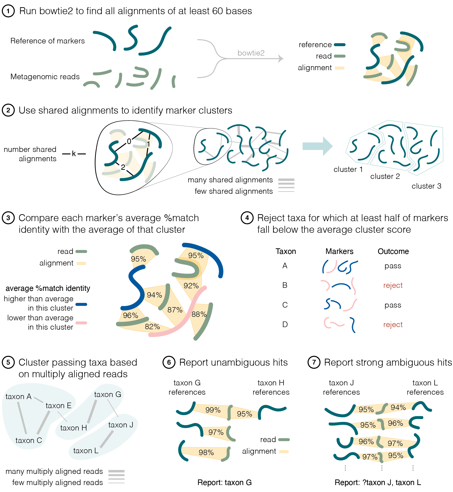
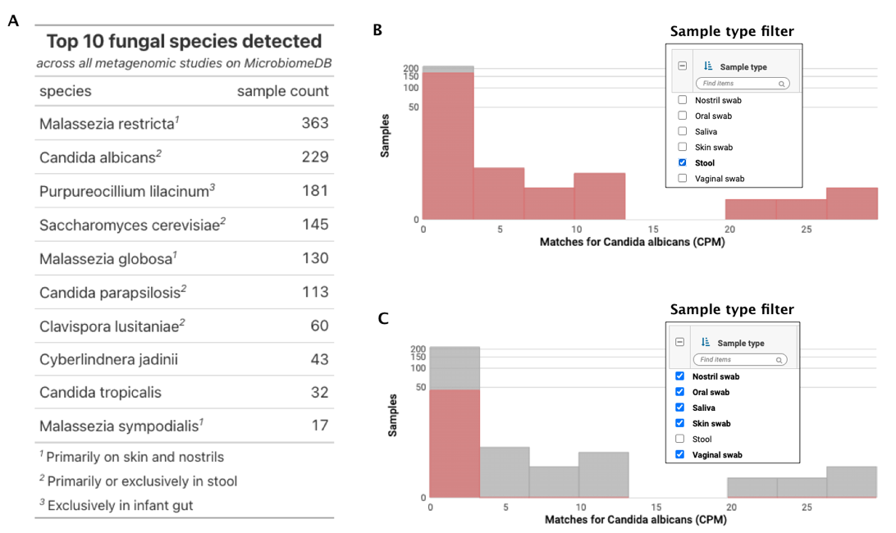

Wojtek Bazant$^1$\*, Ann S. Blevins$^2$, Kathryn Crouch$^1$\*\#, Daniel P. Beiting$^2$\*\#

1. Institute of Infection, Immunity and Inflammation, College of Medical, Veterinary and Life Sciences, University of Glasgow, United Kingdom 

2. Department of Pathobiology, School of Veterinary Medicine, University of Pennsylvania, Philadelphia, Pennsylvania, 19104, USA 

\* To whom correspondence should be addressed. E-mail: kathryn.crouch@glasgow.ac.uk, beiting@upenn.edu

\# Indicates co-senior authors 

Keywords: metagenome, shotgun metagenomics, eukaryotes, bioinformatics, fungi 

## Abstract

### Background
Eukaryotes such as fungi and protists frequently accompany bacteria and archaea in microbial communities. Unfortunately, their presence is difficult to study with shotgun sequencing techniques, since prokaryotic signals dominate in most environments. Recent methods for eukaryotic detection use eukaryote-specific marker genes, but they do not yet incorporate strategies to handle presence of unknown eukaryotes.

### Results
Here we present CORALE (for \underline{C}lustering \underline{o}f \underline{R}eference \underline{Al}ignm\underline{e}nts), a tool for identification of eukaryotes in shotgun metagenomic data based on alignments to eukaryote-specific marker genes and Markov clustering. Using a combination of simulated datasets and large publicly available human microbiome studies, we demonstrate that our method is not only sensitive and accurate, but is also capable of inferring the presence of eukaryotes not included in the marker gene reference, such as novel species and strains. We finally deploy CORALE on our MicrobiomeDB.org resource, demonstrating adequate reliability and throughput.

### Conclusion
CORALE allows eukaryotic detection to be automated and carried out at scale. Since our approach is independent of the reference used, it is applicable to other contexts where shotgun metagenomic reads are matched against redundant but non-exhaustive databases, such as identification of novel bacterial strains or taxonomic classification of viral reads.

\newpage

## Background

Eukaryotic microbes are a large and phylogenetically diverse group of organisms that includes both pathogens and commensals, the latter of which are emerging as important modulators of health and disease. Protists include many important pathogens of humans and other animals, such as *Cryptosporidium*, *Toxoplasma*, *Eimeria*, *Trypanosoma*, and *Plasmodium*. Many fungi are also well-studied pathogens affecting a diverse range of hosts. For example, *Aspergillus fumigatus* is an important cause of respiratory disease in humans [@Latge1999]; *Magnaporthe oryzae* is the most important fungal disease of rice globally [@Wilson2009]; while *Pseudogymnoascus destructans* is the cause of White-Nose Syndrome, one of the most devastating diseases of bats [@Wibbelt2010]. However, recent data also suggests that non-pathogenic commensal fungi are significant as modulators of the human antibody repertoire [@Doron2021][@doron2021mycobiota][@Ost2021], intestinal barrier integrity [@Leonardi2022], and colonization resistance [@Jiang2017]. This diverse array of host-microbe interactions and host phenotypes influenced by eukaryotic microbes underscores the importance of studying this class of organisms in their natural habitats. Unfortunately, the ability to carry out culture-independent analysis of eukaryotic microbes is severely hindered by their low abundance relative to bacteria, which makes accurate detection a challenge and consequently eukaryotes are commonly overlooked in metagenomic studies [@laforest2018microbial]. For example, an analysis of stool metagenomes in healthy adults participating in the Human Microbiome Project [@human2012structure] reports only 0.01% reads aligning to fungal genomes [@nash2017gut]. 

Several methods have been developed to improve the detection of eukaryotes in complex samples. Targeted sequencing of internal transcribed spacer regions (ITS) [@Schoch2012] is a common approach but prevents simultaneous profiling of other members of the microbiome. Alternatively, collections of curated fungal genomes have been successfully used for strain-level identification of *Blastocystis* from stool [@beghini2017large]. However, pitfalls associated with non-specific or erroneous parts of reference genomes [@r2020use] combined with computational challenges associated with carrying out alignments to very large collections of reference genomes [@breitwieser2018krakenuniq] limit applicability of these approaches to the discovery of eukaryotes from the vast amount of metagenomic data already available in the public domain. One attractive solution to this challenge was recently proposed in important work by Lind and Pollard [@lind2021accurate], who base their method for sensitive and specific identification of eukaryotes in metagenomic studies, EukDetect, on alignments to over 500,000 universal, single-copy eukaryotic marker genes. 

We recently sought to add EukDetect results to our web-based resource, MicrobiomeDB.org [@oliveira2018microbiomedb], in order to allow for querying samples based on presence of eukaryotes across a range of human metagenomic studies currently available on the site. Since the EukDetect pipeline does not allow for adjustment of filtering thresholds and it is not packaged for containerised deployments, we decided to implement our own tool built with a more flexible software architecture. We retained EukDetect's reference of marker genes with the aim of producing directly comparable results, and kept `bowtie2` [@langmead2012fast] since it has been shown to be a sensitive aligner [@thankaswamy2017evaluation]. To better understand the filtering process used by EukDetect, conducted a simulation-based evaluation. We noticed that a filter based on mapping quality (MAPQ) [@li2009sequence] scores, though necessary for EukDetect's high specificity, removes correct alignments for which `bowtie2` has inferior but closely scored alternatives.

Considering how the difficulty of detecting a taxon may be affected by similarity of its sequence to nearest references led us to develop CORALE (for \underline{C}lustering \underline{o}f \underline{R}eference \underline{Al}ignm\underline{e}nts), an approach to processing marker gene alignments based on exploiting information in shared alignments to reference genes through clustering. This allows for sensitive and accurate detection while also enabling inference of novel species not present in the reference.

\newpage

## Results

### Species-specific impact of MAPQ filtering 

We base our study of alignments to marker genes on the software for sampling reads `wgsim` [@li2011wgsim], the aligner `bowtie2` used with EukDetect's settings for aligning the reads we sample, and a custom Python program for capturing properties of alignments like the MAPQ score and aggregating results.

Not surprisingly, when reads in a metagenomic sample are simulated from the reference and then aligned back, thus exactly matching the reference, they are accurately mapped to the correct taxon with a precision and recall of 95.1%. Applying a MAPQ ≥ 30 filter increases precision to 99.7% and decreases recall to 91.7%. This translates to 8% of reads mapping with MAPQ < 30, and just under half of those being incorrectly mapped. In contrast, of reads with MAPQ ≥ 30 only 0.3% are incorrectly mapped. 

Stratifying these values by the source taxon of the reads reveals a structural component to the difficulty of mapping the reads, as well as the efficacy of the MAPQ ≥ 30 filter (Figure 1). For example, out of 3977 taxa whose reads map back to the reference, reads from 1908 taxa map with 100% precision (Figure 1, upper rightmost point), and after applying the MAPQ ≥ 30 filter, 1105 more taxa map with 100% precision. Despite this clear improvement after filtering, 146 taxa still map with precision lower than the pre-filter overall total of 95.1% (Figure 1, dotted line). This set of taxa includes numerous species of Aspergillus (Figure 1A), Leishmania (Figure 1B), and Trichinella (Figure 1C), all of which are important pathogens of humans and other mammals. Furthermore, filtering decreases precision for five taxa: fungi *Fusarium cf. fujikuroi NRRL 66890* and *Escovopsis sp. Ae733*, and protists *Favella ehrenbergii*, *Leishmania peruviana*, and *Mesodinium rubrum*.

Since the diversity of eukaryotic taxa extends far beyond the currently discovered species, let alone species present in the EukDetect reference [@Mora2011], we then modify this experiment to study the possibility of detecting 'novel' species; we split the species level markers in the EukDetect reference into a holdout set of 371 taxa and a remaining reference of 3343 taxa, sample from the holdout set, and align to an index built from the remaining reference. In these circumstances, the MAPQ ≥ 30 filter is not on average an improvement: same-genus precision and recall are 82% and 30% without the filter, compared to 83.6% precision and a much-diminished recall of 7% with the filter. Source taxon is a structural component here, too: while applying the MAPQ ≥ 30 filter increases the number of taxa which only map to the correct genus from 48 to 152, it also increases the number of taxa which don't map at all from 49 to 175.

The `wgsim` tool lets us sample reads with mutations, and thus study detection of 'semi-novel' taxa like a non-reference strain of a known species. We modify the setup of aligning reads back to the reference as in the first experiment to run `wgsim` with a mutation rate parameter μ, and increase it in increments. Over μ in range of [0, 0.200], recall declines from 95.1% to below 10% while precision stays between 95-96% for all reads and ≥ 99% for reads with MAPQ ≥ 30 - an observation of bowtie2 preserving precision over recall consistent with e.g. [16]. We then observe that applying the MAPQ ≥ 30 filter causes recall to drop much faster: for example, when μ = 0.1, recall is 68.3% for all reads and 5.0% with the MAPQ ≥ 30 filter.

\newpage

### CORALE leverages Markov clustering for reference-based eukaryote detection
We wrote our software, CORALE - for \underline{C}lustering \underline{o}f \underline{R}eference \underline{Al}ignm\underline{e}nts - as a Nextflow workflow wrapping a Python module. It retrieves sequence files, aligns them to the reference of markers, and produces a taxonomic profile through a seven-step procedure (Figure 2). First, we run `bowtie2` and keep all alignments that are at least 60 nucleotides in length (Figure 2, step 1), which ensures that the matches contain enough information to be marker-specific. We then run Markov Clustering (MCL) on a graph of marker genes as nodes and counts of shared alignments as edge weights (Figure 2, step 2) to obtain marker clusters. Next, we calculate % match identities of alignments (Figure 2, step 3) and aggregate them by marker to obtain an identity average for each marker gene, as well as per cluster to obtain a cluster average. Each marker whose identity average is lower than the cluster average is an inferior representation of signal in the sample, so we next reject each taxon with ≥ 50% of such markers (Figure 2, step 4). We then group remaining taxa into taxon clusters using MCL with counts of multiply aligned reads (Figure 2, step 5), which allows us to reflect ambiguity of identification in reporting the hits. We then report unambiguous matches (defined as having average alignment identity of at least 97%, and two different reads aligned to at least two markers) as is (Figure 2, step 6), while rejecting other taxa in taxon clusters where there were any unambiguous matches reported. Finally, for each remaining taxon cluster, we report it as one hit if is a strong ambiguous match (defined as having at least four markers and eight reads) by joining names of taxa in the cluster and prepending with a "?" (Figure 2, step 7).

A CORALE user can alter this procedure and adjust any thresholds. We set above parameter values as default based on our observations in simulated and human microbiome data, but the software also supports other filters developed in the course of our experimentation. One example is a filter based on the fraction of primary to secondary alignments for each taxon, which is a simpler alternative to the filter based on marker cluster averages but seems to be slightly inferior. Additionally, CORALE has rich reporting capabilities - for example, we produce 'copies per million (CPMs)', a quantitative estimate of abundance calculated as number of reads normalized by marker length and sequencing depth.

\newpage

### CORALE is capable of inferring presence of novel species

To demonstrate CORALE's ability to sensibly interpret a signal from a taxon that is not in the provided reference, we return to the holdout set and remaining reference described before, and prepare an input of 338 samples each with a single 'novel' eukaryotic species at 0.1 genome coverage. We compare CORALE, EukDetect, and two candidate tools whose outputs provide additional context. The first one is "EukDetect (MAPQ ≥ 5)": a version of EukDetect modified to filter MAPQ ≥ 5 instead of MAPQ ≥ 30, and the second one is "4 reads + 2 markers (MAPQ ≥ 30)": a run of `bowtie2` like in EukDetect followed by reporting taxa where at least four reads align with MAPQ ≥ 30 to at least two markers. We judge correctness measured by taxonomic proximity - whether results are the same genus as the 'novel' source of reads - as well as correctness measured by correct plurality of results. 

Out of the four tools, CORALE does best at reporting a single unknown species as a single result in the correct genus (Figure 3). EukDetect's proportion of No Hits is higher than for "EukDetect (MAPQ ≥ 5)" and exactly the same as "4 reads + 2 markers (MAPQ ≥ 30)", which indicates that the MAPQ ≥ 30 filter makes inferring novel species more difficult. 

In the results above, fractions of samples where signal is detected for CORALE, EukDetect, "EukDetect (MAPQ ≥ 5)", and "4 reads + 2 markers (MAPQ ≥ 30)" are respectively 0.607, 0.346, 0.47, and 0.346, and fractions of detected signal reported as one species are respectively 0.8, 0.812, 0.604, and 0.632. This indicates modifying EukDetect to filter on MAPQ ≥ 5 would not be a desirable adjustment, because while it improves the tool's ability to recognise eukaryotic signal in the sample, it compromises the tool's ability to recognise that this signal consists of only a single species. Our method maintains the second ability while improving the first one.

\newpage

### Evaluating CORALE on human microbiome data

To test our method on data where expectations exist about which eukaryotes might be present, we turn to the the DIABIMMUNE study [@vatanen2016variation], for which 136 data points about 30 different eukaryotes were reported across 1154 samples in the original EukDetect publication [@lind2021accurate]. Processing these same 1154 samples, CORALE is in exact concordance with EukDetect on 122/136 data points, and adds additional 97 data points. CORALE reports common taxa at a higher frequency, for example, *S. cerevisiae* appears 67 times, while EukDetect only identifies this organism 31 times. This suggests CORALE is more sensitive than EukDetect. Furthermore, since the other additional hits are not obviously implausible - they consist primarily of yeast and other fungi that have been previously reported in the human gut - there is evidence that CORALE does not compromise specificity.

Importantly, CORALE differs from EukDetect in how it treats reads that might originate from a novel species. For example, in sample G78909 from DIABIMMUNE, EukDetect reports *Penicillium nordicum*, while our method reports a novel *Penicillium*. In sample G80329, our method agrees with EukDetect regarding detection of *Candida parapsilosis*, and also identifies an additional *C. albicans*. Finally, in sample G78500 EukDetect reports *Saccharomyces cerevisiae* and *Kazachstania unispora*, which our method reports to be reads from one taxon slightly different from the reference *Saccharomyces cerevisiae*.

### Automating eukaryote detection with CORALE 

In addition to making our software freely available, we integrate CORALE into the automated data loading workflow for our open-science platform, MicrobiomeDB.org. As of Release 27 (15 Apr 2022), the site contains 6437 samples from 8 published metagenomic studies [@Hayden2020] [@vatanen2016variation] [@Kostic2015] [@Olm2019] [@Gibson2016] [@Gasparrini2019] [@Tee2022] [@Oron2020]. CORRAL finds eukaryotes in 1453/6437 (23%) of the samples, yielding 2084 data points about 190 different taxa. A large majority, 1851/2084 or 89% of these data points, are about fungal taxa, and out of 233 findings of non-fungal eukaryotes, 200 (86%) are about species of genus *Blastocystis*. A summary of the top 10 most frequently observed fungi (Figure 4A) reveals that *Candida albicans*, a prevalent component of gut flora, and *Malassezia restricta*, a common commensal and opportunistic pathogen, are most commonly detected, with presence in 436 and 418 samples, respectively. Since these results are integrated with all other sample annotations on MicrobiomeDB, users can easily identify associations between eukaryotes and metadata (Figure 4B and 4C). For example, *Malassezia globosa* (identified in 130 samples) is primarily found on skin and nostrils, while *C. albicans* (Figure 4B and 4C), *C. parapsilosis*, *Clavispora lusitaniae*, and *S. cerevisiae* are all primarily or exclusively found in stool. 

\newpage

## Discussion

### Use cases and limitations of CORALE
CORALE is a freely available tool that aims to report on eukaryotes in metagenomes without overwhelming the results by false positives. Thanks to our novel approach, we achieve better sensitivity, similar specificity, and additional capabilities, and our tool is reliable enough to let us integrate eukaryotic detection into our open-science platform, MicrobiomeDB.org, and process thousands of samples. CORALE empowers the microbiome research community with a means of setting up broad screens of metagenomic data to identify samples where eukaryotes are present. 

Importantly, using shotgun metagenomics followed by processing with CORALE is not without limitations. A primary hurdle for this approach is the high cost of WGS sequencing to the depth required to detect most eukaryotes. CORALE addresses this setback gracefully, being able to work with minimal information required to plausibly report different kinds of hits. Additionally, future improvements in genome assembly would provide more complete information on eukaryote-specific genomic sequences which could be used to create a larger reference with more taxa and more sequences per taxon, improving both specificity and sensitivity of hits reported by CORALE.

### Future work

Our approach could potentially be applied to processing alignments to any reference that is anticipated to be redundant and incomplete, and where reads are expected to map with varying identity. This includes identification of bacteria to the strain-level resolution required in genomic epidemiology, as well as taxonomic classification of viral reads.

Additionally, the efficacy of using many alignments per read in combination with clustering demonstrated by CORALE shows that to develop new metagenomics tools, it can be worthwhile to view protein sequences as a similarity-based network: naturally occuring proteins form isolated clusters of similar sequence [@smith1970natural]. With additional theoretical work, this view could become a basis for predictions about presence of eukaryotes, potentially providing probabilistic estimates of certainty on reported results.

## Conclusion

CORALE (for \underline{C}lustering \underline{o}f \underline{R}eference \underline{Al}ignm\underline{e}nts) is a tool for identification of eukaryotes in shotgun metagenomic studies in which the results are not overwhelmed by false positives. While CORALE is based on the same marker gene reference as EukDetect, it does not use EukDetect's approach to filtering, most notably not including the MAPQ ≥ 30 filter which we show to have species-specific impact on results. The CORALE approach, based on multiple alignments and Markov clustering, results in sensitive and accurate detection, and is capable of inferring presence of eukaryotes not included in the reference. We highlight this feature using simulated samples with 'novel' species, as well as data from DIABIMMUNE, a large infant gut metagenome study. We also successfully deploy CORALE on our MicrobiomeDB.org resource, demonstrating the appropriateness of our method for large-scale screens of metagenomic data for the purpose of detecting eukaryotes.

\newpage

## Methods

To simulate reads, we use `wgsim` [@li2011wgsim] to sample from EukDetect's reference (the 1/23/2021 version, latest at time of writing, consisting of BUSCOs from OrthoDB [@kriventseva2019orthodb]). We use `bowtie2` [@langmead2012fast] to align reads to references, in end to end (default) mode and the `--no-discordant` flag as in EukDetect. When using `wgsim` we set read length to 100, and base error rate to 0.

To check correctness of simulated alignments, we retrieve the rank of the nearest taxon containing source and match by using the ETE toolkit [@huerta2016ete ] and the NCBI database version dated 2020/1/14 packaged with EukDetect. We deem the alignment correct if the source and match are of the same species, and in case of hold-out analysis where the species is missing from the reference by construction, same genus.

When simulating whole samples, we obtain 338 simulated samples from a holdout set of 371 taxa, because we skip 33 cases the `wgsim` considers the sequences too fragmented to source reads at a set coverage, and errors out. We calculate the number of reads to source per marker to obtain 0.1 coverage as in [@sims2014sequencing].

To run EukDetect, we edit the default config file such that it lists the simulated samples. To run "EukDetect (MAPQ ≥ 5)", we additionally modify the source code of our local installation. To run "4 reads + 2 markers (MAPQ ≥ 30)", we run CORALE configured to use these three filters instead of the default procedure described in this publication.

## Data availability

All our software is publicly available under the MIT license: CORALE (*github.com/wbazant/CORALE*), its main Python module, (*github.com/wbazant/marker_alignments*), and a mix of Python, Make, and Bash scripts to produce simulations, comparisons, and figures for this publication (*github.com/wbazant/markerAlignmentsPaper*). 

All results are publicly viewable and downloadable on MicrobiomeDB. In addition, the following files are available as supplemental material: 

[LINK: Simulated whole samples - results for different methods](https://github.com/wbazant/markerAlignmentsPaper/raw/master/supplement/wgsimWholeSamplesOneTenthCoverage.xlsx)

[LINK: Simulated reads - per-species breakdown and aggregate stats](https://github.com/wbazant/markerAlignmentsPaper/raw/master/supplement/simulatedReads.xlsx)

[LINK: Comparison of CORALE and EukDetect on DIABIMMUNE study](https://github.com/wbazant/markerAlignmentsPaper/raw/master/supplement/diabimmune.xlsx)

\newpage

