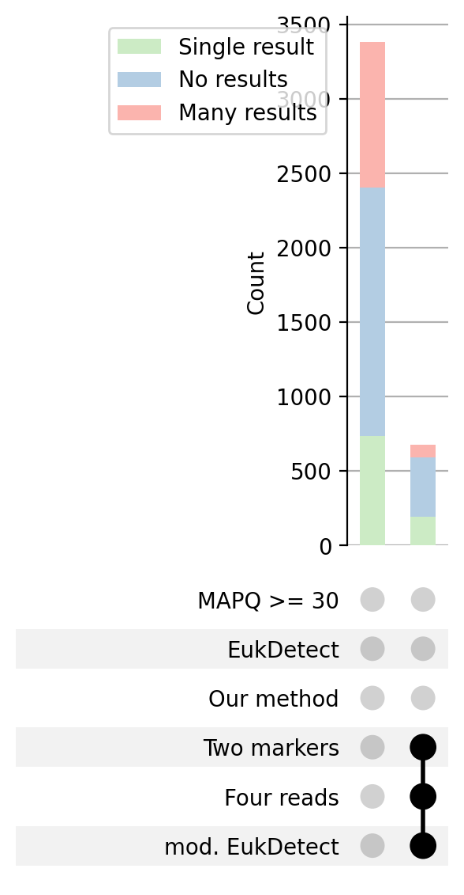
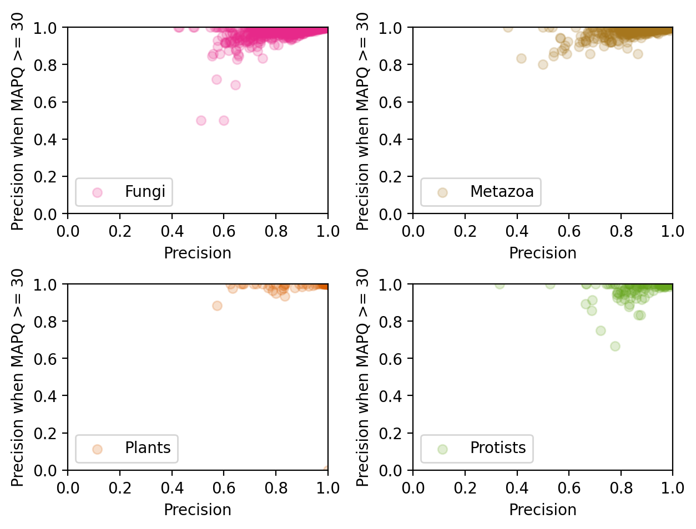

# Mapping metagenomic reads to a reference of markers can detect novel eukaryotes

by Wojtek, Ann, Kathryn, Dan, possibly others

## Abstract

### Background
Eukaryotes such as fungi and protists frequently accompany bacteria and archea in microbial communities. Unfortunately, their presence is difficult to study with shotgun sequencing techniques because they are drowned out by the prokaryotic signal. Recent methods have made detection of known eukaryotes possible through the use of eukaryote-specific marker genes, yet they do not incorporate strategies to detect the presence of unknown eukaryotes.

### Results
We present a method of finding eukaryotes in shotgun sequencing samples based on EukDetect that we have chosen for our open science resource, MicrobiomeDB. Our main modifications are using multiple alignments for each read and relying on match identity instead of MAPQ values.

We demonstrate that our method is in general capable of reporting novel eukaryotes, and that EukDetect's ability to do the same is compromised by its inclusion of MAPQ >= 30 filter on the alignments. We also show that in mapping metagenomic reads, high MAPQ values do not imply a correct match, but often rather an unambiguous one.

Additionally, our method shows improved sensitivity when compared with EukDetect on the DIABIMMUNE study, and the results are in broad agreement with an analysis of stool samples from the Human MicrobiomeProject. We also back up some of our reports of novel eukaryotes with taxonomic profiles constructed from k-mers.

### Conclusion
MAPQ values of alignments can be complex to interpret outside their original context of reference genomes, and they do not make a good filter when searching for eukaryotes in environmental samples. Nevertheless, this is plausible, and can also detect non-reference eukaryotes, like novel species and strains. With our alternative filtering strategy, read mapping becomes suitable as a broad screen for metagenomic data to identify samples where eukaryotes are present, and has enough reliability and throughput to let us proces thousands of samples for our open science resource, MicrobiomeDB.

## Background

### Bioinformatic techniques of detecting eukaryotes

Eukaryotes such as fungi and protists are commonly overlooked in studies of environments such as the human gut [@laforest2018microbial] due to their minute presesence in comparison to bacteria and archea. For example, an analysis by [@nash2017gut] of gut samples of healthy adults from the Human Microbiome Project [@human2012structure] reports only 0.01% reads aligning to fungal genomes. Despite their low abundance, these eukaryotes have a major effect on disease blah blah, which makes their accurate detection important.

Obtaining enough information to study presence of eukaryotes can be achieved by dedicating additional resources: for example sequencing samples with a dedicated protocol, like ITS2 sequencing for fungi [@pryce2003rapid]. When this is not available, additional in-silico techniques can be applied to whole-genome sequencing data originally generated to study populations of bacteria. Screens for individual species or genera can be achieved by aligning reads to reference genomes, for example in the [@beghini2017large] metastudy of gut samples for presence of Blastocystis species. Broad profiling is more difficult, because computational resources needed for aligning reads typically grow with reference size [@burrows1994block], or involve a large in-memory index [@breitwieser2018krakenuniq]. Aligning reads to a reference of only some sequences from reference genomes keeps the reference size small, and can be an attractive way of creating taxonomic profiles. Importantly, the appropriate treatment of alignments produced by sequenced material only accidentally similar to sequences by the reference is a crucial requirement; if the incompleteness of the reference and potential for false positives is not taken into account, reported results can be absurd [@r2020use].

### Motivation for our project

In our open science resource, MicrobiomeDB [@oliveira2018microbiomedb], whole genome sequencing (WGS) data plays an increasingly larger role. Given the number of WGS datasets in the resource and the importance of eukaryote presence in disease, we aim to supplement the hosted data with additional information on the presence of eukaryotes in each sample. Our data comes from relatively well-studied environments such as the human body, but the sequencing depth varies from study to study and grows at a rate that precludes individual analysis of samples. For example, as of 2 Dec 2021, MicrobiomeDB contains 5113 samples with WGS data available. 

With the goal of detecting eukaryotes in these large datasets, our aims for the method were to limit false positives, prevent overlooking large signals, and produce good guesses for weak signals. EukDetect [@lind2021accurate] is a recently developed tool for identifying eukaryotes in WGS data through mapping reads to marker genes that promises accuracy, sensitivity, and a low rate of false positives. We began by investigating the tool to acheive a deeper understanding of the method, then branched our own tool to accommadate new modifications.

### Alignments to markers 

EukDetect harnesses its authors' finding that using a specially prepared reference of sequences only typically present in eukaryotes limits false positives caused by spuriously matching reads from bacteria. The tool's reference of marker genes consists of Eukaryote-specific Benchmarking Universal Single-Copy Orthologs (BUSCOs) from OrthoDB [@kriventseva2019orthodb], `bowtie2` [@langmead2012fast] is the chosen aligner, and a proprietary multi-step process transforms alignments into taxonomic profiles.

<!-- This paragraph sounds more like results or methods -->
<!-- We retain the reference, as well as the `bowtie2` step since it has been shown to be a sensitive aligner [@thankaswamy2017evaluation], but we  review the filters chosen by EukDetect. One filter which we will investigate at length in this publication is based on the reported MAPQ scores - EukDetect only keeps alignments where MAPQ >= 30. It is not the only tool which filters on MAPQ: MetaPhlAn [@segata2012metagenomic], a frequently used program for estimating taxonomic abundance also based on read mapping, also filters on MAPQ, with the default setting of MAPQ >= 5. -->

The reference of marker genes is treated by `bowtie2` as if each marker was a contig in a reference genome. Unfortunately, an alignment to a taxon's marker is not direct evidence for the taxon being present, because a read in a sequenced environmental sample need not come from one of the points in the reference to align to its sequence. Only a small proportion of eukaryotic species has been named, let alone sequenced - the 1/23/2021 version of the EukDetect reference used in this publication contains sequences for 4023 taxa, and there are estimated a 2-3 million of just fungi [@hawksworth2017fungal].

We can stay open to the possibility of exploring some of this diversity if we use available markers as orientation points in the space of sequences. A read from a non-reference sequence might align when its source is near a known point - since naturally occuring proteins form isolated clusters of varying size and in-cluster similarity [@smith1970natural], this is not unlikely.

One property of alignments which relates to distance in the sequence space is match identity, calculated as a fraction of bases that agree between the aligned read and the sequence it aligns to.

MAPQ values of alignments lack a similar geometric interpretation: the SAM specification [@li2009sequence], which `bowtie2` follows, defines MAPQ as an inverse logarithm of a probability that the alignment is wrong, but this is an estimate in the context of mapping reads to a reference genome like the human genome. Aligners differ in how they calculate it [@qcfail2016mapq]: `bowtie2` estimates it using the score it gives to the alignment, score of the next best alignment, and the read's quality scores [@urban2014how]. When reporting more alignments than the best one for each read, `bowtie2` describes the MAPQ scores it reports as not meaningful.

\newpage


## Results

### Our method
For processing MicrobiomeDB data, we run `bowtie2` set to report all alignments, and follow the following procedure to convert alignments into a taxonomic profile:

*Step 1. (Filter alignments on length)*

Keep all alignments that are at least 60 bases long (regardless of their MAPQ score).

*Step 2. (Construct marker clusters)*
<!-- I don't quite follow this one. The markers are reference sequences, correct? And then the distance between them is the number of multiply aligned reads? Then we can use the clustering results to say 'hey this marker is really in its group' or 'this marker isn't really with any group'? -->
Cluster markers using the Markov Clustering (MCL) algorithm with a number of multiply aligned reads for each pair of markers. Compute mean match identity for each marker cluster as well as for each individual marker, and use the values to classify each marker as "at least average in its marker cluster" or "below average in its marker cluster".

*Step 3. (Taxon clusters)*
<!-- Ahh so this is actually filtering our reference set, yes? -->
Reject taxa for which half or more of the markers are below average in their marker clusters. Cluster the remaining taxa using the MCL algorithm with a number of multiply aligned reads for each pair of taxa.

*Step 4. (Unambiguous hits)*

Report taxa which have at least two different reads aligned to at least two markers, and average alignment identity of at least 97%. Reject all other taxa in their taxon clusters.

*Step 5. (Strong ambiguous hits)*

For each remaining taxon cluster that has least four markers and eight reads, join names of taxa in the cluster, prepend "?", and report as one result.
<!-- It is possible a reviewer will ask you how you arrived at the numbers "four" and "eight". Not something to worry about for now but just noting you may have to produce some sort of graph that shows why those nujmbers are optimal. -->

### Simulated samples with unknown species

We first show how EukDetect would handle reads from unknown taxa by running it on known sequences witholded from the reference. We divide the reference set into a smaller reference and a hold-out set that we use to verify unknown organism detection. We then sample from the hold-out set to prepare 338 simulated samples, each with one "unknown" species at 0.1 coverage. 

These inputs give alignments in all but 58 (17%) cases, but EukDetect reports no results in 221 (65%) cases. We obtain the same list of no results with just three filters: to keep only taxa with alignments to at least two markers, to keep only taxa with at least four alignments, and to keep only reads with MAPQ >= 30. Applying different combinations of these filters shows that it is the MAPQ >= 30 filter that is responsible for most dropout: the other two filters together only drop 132 (39%) samples, but just the MAPQ >= 30 filter alone drops 186 (55%) samples.

Modifying EukDetect to filter on MAPQ >= 5 is not an adequate adjustment. While it improves the tool's ability to recognise eukaryotic signal in the sample, it compromises the tool's ability to recognise that this signal consists of only a single species. Our method maintains the second metric while improving the first one - the values for EukDetect, modified EukDetect, and our method are respectively 35%, 47%, 61% for fractions of samples where signal is detected and 81%, 60%, 80% for fractions of detected signal reported as one species.




\newpage

### Simulated reads and references
To further explore benefits and drawbacks of the MAPQ >= 30 filter, we conduct a series of in-silico experiments based on sourcing reads from a reference and aligning them back to a version of the reference. In each experiment, we choose a source of reads to simulate and a reference to align them to, and then simulate and align them in a way that lets us capture MAPQ of aligmnents together with a degree of difference between source taxon of each read and the taxon of the sequence it aligns to. We run four of these: 
1. reads sampled from the whole reference and then mapped back to it (an optimistic approximation of data from well-studied environments),
2. reads sampled and mapped back to a small duplicated reference (regions of higher resolution in the reference),
3. reads sampled from the whole reference which are then modified (an approximation of data where a sampled organism is of a different strain to the reference), and
4. reads from a hold-out set mapped to the remaining set (a case of unknown species in the data).

When the source sequence in a metagenomic sample exactly matches the reference (experiment 1), we see that aligning reads back to their sources appears easy, and requiring MAPQ >= 30 overwhelmingly favourable. Most reads map correctly - total precision and recall are both 95.1%, and adding the MAPQ >= 30 filter increases precision to 99.7% while decreasing recall to 91.7%. To convey the same information with a differently calculated statistic: 8% of the reads map with MAPQ < 30 and 46.2% of those are incorrectly mapped, while among reads with MAPQ >= 30, only 0.3% are incorrectly mapped. For MAPQ >= 5, precision and recall are 99.0% and 96.0%.

Stratifying this data by source taxon of the reads reveals that the source is a structural component in difficulty of mapping the reads, as well as the efficacy of the MAPQ >= 30 filter. Out of 3977 taxa whose reads map back to the reference, reads from 1908 map with 100% precision. After applying the MAPQ >= 30 filter, 1105 more taxa map with 100% precision, but 146 taxa still map with precision lower than the pre-filter overall total of 95.1%. In the case of five taxa (*Fusarium cf. fujikuroi NRRL 66890, Escovopsis sp. Ae733, Favella ehrenbergii, Leishmania peruviana, Mesodinium rubrum*) applying the filter decreases precision, and for one taxon (*[Chlamydomonas] debaryana var. cristata*) applying the filter removes all reads.



A version of the reference in which a smaller amount of sequences are included twice (experiment 2) shows a small amount of redundancy in reference sequences and does not compromise same-species precision or same-species recall (both are 99.6%). However, it renders MAPQ values unusable, making them almost uniformly 0 or 1.
\newpage

Reads aligned to a complete reference, but mutated before the alignment (experiment 3), show that increasing the difference between reference and signal produces a gradual change in precision (Fig. 2). As we increase the mutation rate until recall drops below 10% (mutation rate = 0.200), we observe that precision stays between 95% and 96% throughout the entire range of mutation rates. This finding is concordant with `bowtie2` preserving precision over recall as seen in e.g. [@peng2015re]. Keeping only reads with MAPQ >= 30 improves precision to between 99.6% and 99%, similarly to the case of unmutated reads, but the fraction of reads with MAPQ >= 30 declines more rapidly than recall does, showing that departing from the reference makes the MAPQ >= 30 filter increasingly unfavourable.


Reads sourced from the hold-out set and aligned to the remaining set (experiment 4) give additional evidence that filtering on MAPQ decreases ability to detect unknown taxa: same-genus precision and recall are 82% and 30% for reads with any MAPQ, 83.6% and 7% for reads with MAPQ >= 30, and 87% and 18.2% for reads with MAPQ >= 5. Again, source taxon is a structural component in difficulty of mapping the reads as well as the efficacy of the MAPQ >= 30 filter. Among 322 out of 371 taxa in the hold-out set whose reads map to the remaining set, 48 map only to the taxa of the same genus, while 117 do not map to taxa of the same genus at all, and applying the MAPQ >= 30 filter only keeps reads mapping to correct genus for 94 more taxa, while removing all reads that map to the correct genus in 6 cases, and removes all reads for 126 taxa.

<!-- this point doesn't fit in here. So maybe it doesn't fit in the paper at all? --> 
Re-analysing these four experiments using taxonomic information informs us about kinds of incorrect alignments that are most likely to occur: broadly, most misses are near misses. When the source is in the reference, reads that align, but not to a sequence of their species, usually align to a sequence of another species of the same genus: 89% in experiment 1. When the source is not in the reference, reads that align, but not to a species of the same genus, usually align to a sequence of another species in the same family: 73% in experiment 4.

In total, we see that the success of read mapping, and the efficacy of subsequent filtering, depends on how the sequence of a source taxon relates to markers in the reference. The MAPQ >= 30 filter is helpful in further increasing precision of mapping fairly unambiguous reads, but detrimental in many other cases.

\newpage


### Comparing species detected by our method to known results
The shortcomings of filtering on MAPQ demonstrated above do not in themselves make a case for our method as an alternative, so we next turn to a comparison of results produced by our method on datasets where we can have expectations about which eukaryotes should exist.

We start from the DIABIMMUNE study [@vatanen2016variation], for which 136 data points about present eukaryotes were reported across 1154 samples in the original EukDetect publication. Having processed the same 1154 samples, our method agrees with EukDetect on 122 data points, provides 97 additional data points, and EukDetect has additional 14. None of the results we additionally report stand out as implausible under manual inspection: they are yeasts and other eukaryotes which have previously been reported in the human gut, and an increased frequency of reports of common taxa points to higher sensitivity of our method. In particular, a common taxon *S. cerevisiae* is reported 67 times by our method and 31 by EukDetect.

Our method differs from EukDetect on how it treats signal that might be from multiple related species and contains some ability to report species as novel, and this sometimes produces different results. To give a few examples:
- in sample G78909, EukDetect reports *Penicillium nordicum*, while our method reports a novel *Penicillium*,
- in sample G78500, EukDetect reports *Saccharomyces cerevisiae* and *Kazachstania unispora*, which our method reports to be just a non-reference *Saccharomyces cerevisiae*, and
- in sample G80329, our method agrees with EukDetect about *Candida parapsilosis*, and reports an additional *C. albicans*.

We also compare our pipeline with [@nash2017gut], who search for fungal reads in WGS data in Human Microbiome Project [@turnbaugh2007human] through alignments to a reference of 1315 whole fungal genomes depleted of regions that might be bacterial, which are then refined through removing hits which also match reads in non-redundant bacterial databases. Their method assigns reads to 268 different species in 380 out of 472 tested samples, which aggregated by read and sample gives 1487 data points. 

Applying our method to 380 samples where the authors found fungi produces a much narrower list of species, but less data, as we identify 25 fungal species in 96 of the samples: a total 121 data points. The lower number of samples where any fungi are found points to lower sensitivity of our method, and we estimate the recall of our method to be about 4% for this data source based on *Saccharomyces cerevisiae* being reported only 18 times by us while probably being present in most samples as evidenced by the authors finding *Saccharomyces* in 96.8% of their ITS results. Nevertheless, the results we produce are broadly in agreement, since we replicate the authors' finding about four most prevalent genera in the samples being *Malassezia*, *Saccharomyces*, *Cyberlindnera*, and *Candida*. Comparing top hits in 96 samples where there is data for both sources gives 29 species level agreements, and 42 genus level agreements about top hit being *Malassezia* (we see *M. restricta*, the authors mostly *M. globosa*). In samples where top hits in both sources are for the same species, counts of reads follow a linear relationship - least squares regression R-squared value is 0.998 with coefficient = 0.0309 and n = 27 - that is to say, the number of reads we align to EukDetect's marker sequences is about 3% of reads reported by the authors.


<!-- This was interesting at a time, but loses focus -->
<!-- While the picture our results draw is not complete, they contain enough information to generate hypotheses and further leads. Findings of eukaryotes that can potentially cause disease include a protozoan *Trichomonas tenax* in two oral samples, and 4 / 10 of samples from the subject ID 246515023 contain a disease-causing fungus *Aspergillus fumigatus*. -->


Finally, we process infant stool samples from the Preterm Infant Resistome study [@gibson2016developmental]. We uncovered that a sample corresponding to SRA run ID SRR3132435 has been colonised by organisms from the *Mucor* genus, possibly between sample collection and sequencing. This is not reported by EukDetect despite over three thousand reads from the sample mapping to *Mucor* markers, because they all get filtered out by the MAPQ >= 30 filter. Our method reports a presence of a species of *Mucor* most similar to *M. velutinosus*, *M. circinelloides*, and *M. ambiguus*. A second source to support this result is STAT [@katz2021stat], assigning 0.34% of the reads assigned to order *Mucorales* on the basis of k-mer similarity.
<!-- This one could also use a figure. Maybe a panel for this one and a panel for diabimmune? Either venn diagrams for both or some histograms with stats below or something. Not sure what people would want to see here. Dan would know. Maybe a bar plot wiht different taxa of interest and grouped by algorithm? Looking at the eukdetect paper for ideas... -->

<!-- say that from here on out all mbioDB data will be processed like this. -->
Starting with Release 25 (2 Dec 2021), all whole genome sequencing data available on our site, MicrobiomeDB - 5113 samples in Release 25 - is additionally profiled for presence of eukaryotes. 


## Discussion

In this work we offer a method that improves upon recent methods for eukaryotic detection by improving identification of unknown taxa. We demonstrated that the commonly used MAPQ <= 30 filter prevents detection of unknown taxa, and furthermore that by using match identiy instead we are sensitive to taxa that exist in the sample but not our dataset. Finally we used publicly available datasets to compare our method to EukDetect, and with our method we identify many novel species that remain unreported by EukDetect.

### Rationale behind our method
For MicrobiomeDB, we aim to produce taxonomic profiles for a range of environmental data that may include novel species or strains. Based on our findings, this goal requires us to move away from the MAPQ >= 30 filter currently applied in published methods such as EukDetect. Our simulations establish that alignments to markers are only approximately correct - around 95% in general - with most misses being near misses, and novel species appearing as hits in groups of related taxa.

We set `bowtie2` to report all alignments per query to be able to group reads by source - reads which map to multiple markers inform us that hits to those markers are in general related. Since presence of secondary alignments distinguishes a single unknown organism from a plurality of organisms, we can treat secondary alignments as a source of negative information - this is the basis for rejecting taxa with a few primary or unique alignments and a majority of secondary alignments.

We choose MCL to group reads which are likely to come from the same source for practical reasons, since it is a well-established method of producing clusters from measures of similarity. 

### Limitations
Our method requires a reference of markers whose sequences are quite specific to their taxa, but the fewer sequences the reference has per taxon, the higher sequencing depth required to produce enough reads. Using a larger set of markers could improve the sensitivity of our method.

We chose various threshold parameters - 60 bp as minimum read length, two as the number of markers to report a taxon, 97% as match identity of unambiguous species - either by replicating EukDetect's thresholds or on an empirical basis. While these details are easy to change - in our software, readers interested in applying our method can adjust the thresholds and combine them with a few other filters we implemented - our filtering process has no unified theoretical basis. A different set of filters that involve statistical modelling could result in a method with more natural parameters, and add a quantified measure of uncertainty associated with each prediction.

### Our interpretation of MAPQ values
In our results, MAPQ values are generally high when the source of a read is close to a sequence in the reference and the read comes from a reasonably unique region. MAPQ values are low for reads whose nearest neighbour is either ambiguous or distant. This shows that the field's original definition for alignments to reference genomes ( a negative logarithm of a probability that the alignment is wrong [@li2009sequence] ) retains its intuitive meaning as a measure of certainty of location when used in metagenomics.

Reads can map correctly as well as with low MAPQ in particularly congested areas of sequence space because a read coming from a segment shared between sequences does not contain enough information to assign it to the source. Our data suggests this might be the right model for a large fraction of errors, because most misses are near misses. Meanwhile, when the source of reads is quite distant from its nearest reference which is nevertheless the best match for each read, reads either do not map or they correctly map with low MAPQ.

### Future work
Our method can be applied by others to set up broad screens of metagenomic data to identify samples where eukaryotes are present.

The idea to use multiple alignments per query as a basis for similarity clustering could be applicable in conjunction with tools for reference-guided assembly. We have explored this briefly with KMA, setting it to report all assembled fragments, running an all-to-all nucleotide BLAST at 97% identity on the fragments, converting matches into similarity measures by computing ratios of query length to template length for each match, and running MCL. The results seemed interesting for samples dominated by a novel unknown taxon, similarly to the tool's intended use in genomic epidemiology. KMA's assembly capabilities were of little use to us in detecting eukaryotes at low coverage, and additional resource costs were formidable, so we have not further investigated its use.

It could be investigated whether aspects of our method could be applied to general-purpose profilers based on read mapping, like MetaPhlAn. MetaPhlAn is a well-optimised method that does very well in benchmarks like OPAL [@meyer2019assessing] or CAMI [@fritz2019camisim], and finding alternative to its MAPQ >= 5 filter could allow further incremental gains, perhaps including more sequences in its reference and thus allowing for resolution at strain level.

<!-- Also quantifying how much is there? I think we had talked about that in an mbio meeting a long time ago? -->
<!-- A section on limitations would also be helfpul, if there are any important ones to talk about! -->

<!-- In the eukdetect paper's discussion, they have this line "One important limitation of our approach is that only eukaryotic species with sequenced genomes or that have close relatives with a sequenced genome can be detected by the EukDetect pipeline." It goes on to say that their plan to deal with currently unknown eukaryotes is to wait for sequencing data to become available and scale their reference database. Could be good to touch on this at some point since we'll never actually get 100% of organisms in the database, so we need to be able to gracefully handle unknowns. -->

\newpage

## Conclusion

We have shown that the MAPQ >= 30 filter used by EukDetect decreases the tool's sensitivity at detecting unknown species, and demonstrated why: MAPQ values are typically high for unambiguous matches, and low when the source species differs from anything in the reference or if the reference is redundant. Changing MAPQ >= 30 to a more permissive value like MAPQ >= 5 offers slightly different trade-offs - higher precision and recall for unknown species, but also an increased number of off-target hits, and it is not unambiguously an improvement.

We have proposed an alternative strategy to filter results, based on match identity and incorporating multiple alignments, and developed tooling around this strategy - a Python package `marker_alignments` to produce taxonomic profiles using an input of alignments to markers, and a Nextflow workflow `wbazant/marker-alignments-nextflow` that bundles it with `bowtie2` and EukDetect's reference

We have also provided a comparison of data processed by our method with several other sources, demonstrating a robust incremental improvement - we achieve higher sensitivity overall, we are able to report of taxa not available in the reference, and enough reliability and throughput to let us proces thousands of samples for MicrobiomeDB.

## Methods

### Software
We use `wgsim` [@li2011wgsim] to simulate reads from EukDetect's reference of BUSCOs from OrthoDB [@kriventseva2019orthodb], and use `bowtie2` [@langmead2012fast] to align them back to the reference. When using `wgsim` we set read length to 100, base error rate to 0, and other parameters set to their default values unless otherwise specified. We run `bowtie2` in end to end (default) mode.

We organize simulations and make figures for this publication using a custom Makefile and Python code, which we have made publicly available.

We process `bowtie2` outputs and apply filters with our software tool, `marker_alignments`, for producing taxonomic profiles from alignments of marker genes. We have developed the tool side by side with this publication to explore aforementioned ideas about query identity and multiple alignments per query, and realize a design goal of producing good guesses from a small amount of alignments to a potentially incomplete reference. The tool is implemented in Python. It uses the `pysam` module to read alignment files, a `sqlite3` database to store alignments and build reports, and the MCL algorithm to convert pairwise similarities of markers and taxa into cluster assignments [@van2012using].

To process entire datasets we use our Nextflow workflow, `wbazant/marker-alignments-nextflow`, which bundles file download, a run of `bowtie2` set up to produce multiple alignments per read, and processing the alignments.

### Calculations
We judge correctness of simulated alignments using the level of the lowest common taxon containing source and match, as provided by the ETE toolkit [@huerta2016ete ] using the NCBI database version dated 2020/1/14 packaged with EukDetect. We deem the alignment correct if the source and match are of the same species, and in case of hold-out analysis when this is not possible by construction, same genus.

Our calculations of precision and recall are in line with definitions in the OPAL framework [@meyer2019assessing], as proportion of correctly mapping reads among reads that map to any reference (for precision) and proportion of sampled reads that correctly map (for recall).

### Different reference versions
*EukDetect's reference*: we use the 1/23/2021 version of the reference provided by EukDetect, latest at time of writing.

*Hold-out and remaning set*: we approximate the possibility an unknown species being present in the sequenced material through a hold-out analysis. We remove sequences for 371 species from the reference (one tenth of the species) to form a hold-out set, and build a `bowtie2` index with the remaining nine-tenth of the species for searching the remaining set.


*Duplicated reference*: Similarity of reference sequences makes mapping reads more difficult, and the need for strain-level differentiation in fields like genomic epidemiology has inspired the creation of specialized aligners like KMA [@clausen2018rapid]. To understand how `bowtie2` is affected by duplication of sequences, we prepare an index of 371 species from the reference where each sequence is included once as originally, and once after extending it by a single "A" base.

### Simulated whole samples
To simulate whole samples, we skip 33 inputs where `wgsim` considers too fragmented to source reads from at a set coverage, yielding 338 samples. We select the number of reads to source per marker so as to achieve uniform 0.1 coverage, as calculated in [@sims2014sequencing].

To run EukDetect, we edit the default config file such that it lists the simulated samples. For the MAPQ >= 5 modification, we additionally modify source code of our local installation.

To obtain equivalent results with no or some filters applied, we run `bowtie2` in end to end mode, and apply combinations of filters with our `marker_alignments` package.

### Simulated reads
Here is a list of different experiments where we simulate and track alignments of individual reads in the order of mention in the results section:
1. Simulate a read from reference, align back to the reference
2. Simulate a read from reference, align back to duplicated reference
3. Simulate a mutated read from reference (for various mutation rate parameters), align back to the reference
4. Simulate a read from hold-out set, align to the remaining set

We perform each of the experiments approximately one million times and aggregate summary statistics. Full results are available in the supplemental material.

## Data availability

All our software is publicly available under the MIT license: the Python package, (*github.com/wbazant/marker_alignments*), the Nextflow workflow (*github.com/wbazant/marker-alignments-nextflow*), and a mix of Python, Make, and Bash scripts to produce simulations, comparisons, and figures for this publication (*github.com/wbazant/markerAlignmentsPaper*). 

All results are publicly viewable and downloadable on MicrobiomeDB. In addition, the simulation results and the DIABIMMUNE comparison can be found in supplemental material. 

\newpage
\newpage
\newpage
\newpage
## Not in the paper

\newpage

## Results (old)

The first three experiments show EukDetect's limited capacity to sensibly report on species not in its reference is related to its MAPQ filter. The next four experiments establish the baseline success rate of identifying simulated reads in various circumstances, and show that the effects of filtering on the MAPQ property are non-uniform and not always beneficial.
 ...
We investigate it by applying some of EukDetect's filters in turn. The first filter based on query length has no effect as we are using simulated reads. The second filter applied by EukDetect, based on the MAPQ field, reduces the number of samples with any mapped reads to just 156, additionally requiring reads mapping to two different markers in a taxon narrows down the list further to 133, and also requiring four reads fully accounts for all missing results. Skipping the MAPQ >= 30 field and only requiring two markers and four reads in a taxon reports results for 206 samples. This shows that the choice of filtering rules is key to sensitive detection of organisms using mapped reads.
## Abstract (old)
Eukaryotes such as fungi and protists are frequently present in microbial communities. In environments like the human body, their quantities are very small compared to bacteria and archea except in cases of severe disease. This means identifying them from whole-genome sequencing reads can involve extensive manual curation of results: there may not be enough signal to make confident assignments based on k-mer similarity, and a straightforward approach of aligning reads to all known eukaryotic genomes produces false positives from bacterial reads aligning to spurious contigs. EukDetect is a recently published taxonomic profiling tool based on read mapping that avoids spuriously aligning bacterial reads by using a reference of marker genes - a specially prepared collection of sequences which can be trusted to only be present in eukaryotes. However, the possibility of a presence of an unknown eukaryote is not taken into account.

The first part of this publication focuses on evaluating EukDetect's method. Building a taxonomic profile through aligning reads to marker genes corresponds to positioning sources of reads in the space of sequences, so we use simulations from the reference to explore various configurations. The performance is uneven: the tool is frequently very accurate and sensitive, but for some sources of reads it can also work less well. Our simulations show that this is due to the tool's strategy to filter aligned reads on the MAPQ value of alignments, and that this value is lower for sources the most similar marker is either fairly dissimilar, or ambiguous. Mapping reads to a reference of markers is not inherently limited in this way - we simulate cases of the sequenced material contains an unknown species or a non-reference strain of a species, and show a high degree of approximate correctness, which is partially lost when the MAPQ filter is applied.

The remainder of this publication describes our Python tool, `marker_alignments`, which we developed to assess various ways of producing taxonomic profiles from alignments to EukDetect's reference of markers, and an alternative workflow we have chosen for identifying eukaryotes in whole genome sequencing data of human samples in our open science resource, MicrobiomeDB. We outline our strategy based on incorporating all available alignments for each read and comparing average match identity per marker, and separate thresholds for clear trace signals and strong ambiguous hits. 

We evaluate our workflow through comparing it with EukDetect on the DIABIMMUNE study, with an analysis of stool samples from the Human MicrobiomeProject based on whole genome alignments, and back up some of our reports of novel eukaryotes with profiles based on k-mer data. This lets us demonstrate our workflow's suitability for broad screens of metagenomic data to identify samples where eukaryotes are present.

## Information about mismatches

Assigning a read to the sequence it is most similar to is generally possible with `bowtie2`, and frequently very successful: reads simulated from 1908 / 3977 taxa map back with 100% precision as quoted before, and same-genus precision of mapping reads from a hold-out set is as high as 82%. 

EukDetect introduces an element of anticipating potential mismatches - for each genus, a taxon with the most matching reads and greatest coverage is considered the primary for its genus, and a more stringent burden of evidence is placed on any other results in the same genus. It is shown that together with a filter of minimum read count, the method can distinguish a true mixture from off-target hits when simulating reads from two closely related species of *Entamoeba* at a wide ranges of coverage.

Our simulations show that the difficulty of distinguishing species from each other might be highly variable. 

For each taxon, we count reads sampled from the sequences of that taxon that align back to it, compare it to the count of sequences sampling to each other taxon, and sort by the ratio of the two. 
*E. dispar* is mismatched as * E. histolytica * only once compared to 75 reads, and in general simulated *Entamoeba* reads turn out to not be particularly difficult to map back to their source - among 7172 pairs, the  the *E. nuttali* reads being aligned to *E. dispar* at a ratio of 0.08 are the highest on the list at position 940, a far cry from a 0.86 ratio for two brown algae * Ectocarpus sp. Ec32 * and * Ectocarpus siliculosus*.


Also, coming back to the MAPQ stuff - the mechanism by which the MAPQ >= 30 filter improves precision is revealed when we look at precision vs. MAPQ for each source species, for reads sampled without added mutations.

Basically, different species can be more or difficult to tell from other, similar ones. MAPQ is a proxy measure for that - except it's not a reliable way to tell that a match is wrong, MAPQ is frequently low for good matches and when a source species is not in the reference there are plenty of high MAPQ matches to incorrect results. The task of mapping a 100bp read back to its source is in general very easy for a modern aligner, requiring MAPQ >= 30 dings everything that has a chance of being wrong - which for some species means throwing away most of the reads - and that's the secret of 99.5%+ precision on simulated reads.


\newpage

## Sequence space stuff

Maynard Smith, John (7 February 1970). "Natural Selection and the Concept of a Protein Space". Nature. 225 (5232): 563–564. Bibcode:1970Natur.225..563M. doi:10.1038/225563a0. PMID 5411867. S2CID 204994726.

- the landscape of existing proteins is made up of islands of related sequences
- mapping reads corresponds to a problem of finding the nearest neighbour
- explains variability of success: 
- suggests link between correctness of match and identity?


Filtering on the MAPQ field does not originate with EukDetect - it is also present in MetaPhlAn [@segata2012metagenomic]. 

Tools for read mapping like `bowtie` or `samtools` have been developed in the context of reference genomes like the human genome [ @langmead2009ultrafast ], [@li2009sequence]. 

The SAM specification originating with `samtools`, which `bowtie` and `bowtie2` follow, defines the MAPQ field as a measure of certainty about position of the alignment. 

The variance in trade-offs offered by the MAPQ >= 30 filter can be 
In the context of neareast 

MAPQ is a measure of ambiguity, and decreases when there are several nearby proteins or when there 


Tools for read mapping like `bowtie` or `samtools` have been developed in the context of reference genomes like the human genome [ @langmead2009ultrafast ], [@li2009sequence]. The SAM specification originating with `samtools`, which `bowtie` and `bowtie2` follow, defines the MAPQ field as a measure of certainty about position of the alignment. Eukdetect aligns metagenomic reads with `bowtie2` to a reference which is not like a single reference genome - it contains groups of similar sequences from many genomes - and one of the filters it applies to the alignments is to require MAPQ >= 30.

 Bornberg-Bauer, E (Nov 1997). "How are model protein structures distributed in sequence space?". Biophysical Journal. 73 (5): 2393–403. Bibcode:1997BpJ....73.2393B. doi:10.1016/S0006-3495(97)78268-7. PMC 1181141. PMID 9370433.


## Network stuff 
```
todo this is not yet coherent
```

To make use of alignments which are only mostly correct, we need a source of information on what markers and taxa are likely to be confused with each other. 

We investigate an alternative approach of using secondary alignments.

EukDetect introduces a concept of primary and secondary hits: a taxon with the most matching reads is considered a primary taxon for its genus, and a more stringent burden of evidence is placed on any other (secondary) results in the same genus.

It works well when simulating mixtures of species at even low coverage, but fails to account for an unknown species present at a relatively high coverage - see the quick cross-validation result at the top.

We believe that off-target alignments need a more nuanced treatment.

### Diagram
We have a theoretical model presented by these two diagrams:


Diagram 1a. With X' and X'' differing from X only by aggregated single-nucleotide changes, reads preferentially map to the closer X'. MAPQ and percentage identity get lower, but the information in the reads is sufficient to report the nearest taxon.
```
  ___ X''   AACTAACAATATAA
 /
 \____ X'   AACAAACAAAAATA
  \____ X   AAAAAAAAAAAAAA
```

Diagram 1b. If X' misses some of the sequence, some reads map to X'' instead.
```
  ___ X''   AACTAACAATATAA
 /
 \____ X'   AACAA____AAATA
  \____ X   AAAAAAAAAAAAAA
```

\pagebreak


### Measuring network structure

Some markers get confused with each other more often than others, specifically, an off-target hit is likely to be a hit to a related protein from a closely related organism. This is a basis of EukDetect's `eukdetect/count_primary_and_secondary.py` program, which uses a partition of markers based on their taxonomic origin.

EukDetect's method corresponds to an error model where all equivalently annotated BUSCOs in genus level are considered confusable enough to require the more stringent cutoffs, and off-target hits on differently annotated BUSCOs or in different families are considered insignificant enough to be removed by other filters.

We can compare how well this partition captures markers in each simulated result by using the modularity formula:

```
Q = fraction of edges within clusters / fraction of edges between clusters
```

applied to a graph where each node is a marker and each edge weight is a count of mis-classifications.

We can also compute partitions using the MCL algorithm frequently deployed in bioinformatics in the context of sequence match, as well as the Leiden algorithm, a general-purpose tool for community detection.

Here are the results: TODO :).

As we see (TODO) the performance of the per-genus partition varies based on error rate introduced to the reads, and is not as good as an optimal partition calculated using the ground truth information.

We do not need an a-priori list of markers that might get confused with each other: it can be observed by setting the aligner to report all alignments per query, and using counts of shared alignments as edge weights between markers, then running the same algorithms as before.

It depends on coverage, but here are some results: TODO.


## Summary of our method
```
This is the method

It is unfortunately really ad-hoc, how do I make it less ad-hoc?

```

TODO say it's research software :) We show using identity and all alignments might be better, we have a PYthon package for exploring this kind of thing.

### `bowtie2`
We set `bowtie2` to report multiple alignments per query. This lets us add structure on the level of markers:
- count reads aligned multiply for each pair of markers as proxy for similarity
- use the MCL algorithm to produce clusters
- use average alignment identity as proxy of distance from "true" sequence
- use count of reads as evidence threshold
and similarly on the level of taxa.

This lets us set up a sequence of filters similar to EukDetect without relying on the MAPQ field.


### `KMA`
We set KMA to report all assembled fragments of reads for each template.

We process the fragment with an all-to-all nucleotide BLAST at 97% identity. For each pair of fragments that match, we compute their similarity as a fraction of query length to template length. Then we run MCL.

We have found KMA helpful in investigating samples that are dominated by a novel unknown taxon, similarly to the tool's intended use in genomic epidemiology. Its additional capabilities are of little use when detecting rare species - say a eukaryote that only contributes a small number of reads to the metagenomic sequence - and the resource costs are formidable, so we have not further investigated its use.

## Software implementation
```
to do:
This section is about the software
Figure out what should actually be here
```

We implement our way of interpreting results of alignments to markers as a Python package, `marker_alignments`. It uses a module `pysam` to read alignments into a following SQLite table:

| column | type | description |
| -- | -- | -- |
| query | text | read identifier |
| taxon | text | name of matched taxon |
| marker | text | name of matched taxon |
| coverage | number | fraction of marker covered by match  | 
| identity | number | fraction of bases agreeing between query and reference  | 

Counts of entries and the coverage field are used for quantification, and identity is mainly used for clustering and filtering.

Filtering and reporting is implemented with SQL queries and Python code. 

Clustering is based on a `markov_clustering` package, a Python implementation of the MCL algorithm.

In addition we also provide a Nextflow workflow, `marker-alignments-nextflow`. All our software is freely available on GitHub under an MIT license.


# Examples
```

```
## What would make a good example?

A good example would be specific to the improvement in the method: something about better specificity, or reporting variation in species beyond what SNPs can produce.

Maybe reporting those missing pieces of protein from diagram 2?

## Interesting cases I came along
### Example 1 - off-target hits in more than just a genus
SRR6262267 is a run from a sample dominated by *Trichosporon asahii* - according to SRA Traces, 23.68% of the reads in the sample can be attributed to this organism ([source](https://trace.ncbi.nlm.nih.gov/Traces/sra/?run=SRR6262267)).

```
TODO an example - perhaps a heatmap of counts for BUSCOs in each Trichosporon?
Actually, EukDetect reports only T. asahii, because the other off-target hits are for the same genus - find something :).
TODO this will require some visualisation tools.
```

### Example 2 - sticking to the reference too closely brings up nothing
Mucor example, demonstrate EukDetect returns nothing which it really should.

### Example 3 - BUSCOs vs clusters
Maybe a drawing or a visualisation: a graph with BUSCOs corresponding to a shading of each node, added edges, and a shading or a line around clusters that end up together?

## Potential application 1 - host blood meal
Identify host blood meal in metagenomic studies of mosquitos.


## Potential application 2 - AMR
Detection/quantification of antimicrobial resistance (AMR) genes in metagenomic samples

## MicrobiomeDB studies
```
to do:
This is about MicrobiomeDB results.

Decide if they should be a part of the paper and how.
```

We analyzed all data on MicrobiomeDB.

| study | num samples | num samples with reported taxa | num reported taxa |
| -- | -- |-- | -- |
| HMP | xxx | yyy | zzz |


## DIABIMMUNE
```
to do:
This is an expanded part of the above that does a comparison for DIABIMMUNE.
Write a program to report the numbers, for transparency and because you will need to redo it.

Make a point that our method improves sensitivity, and to have a comparison, maybe independently align to whole cDNA of S. cerevisiae?

```

Here's a not yet formal comparison to DIABIMMUNE.
DIABIMMUNE reports 

Just the paper DIABIMMUNE reported 8 samples. I think it's mostly the difference between references - new one has a bit more.
We're more courageous in reporting species, and report 119 extra results. It shows up for the most common S. cerevisiae - we call it 42 more times - and M. restricta - 9 more times.

### 3100266
Here's a case where we do something weird. EukDetect reports P. nordicum, but we realise it's a cluster:
```
id      taxon   num_markers     num_reads       avg_identity
1       1429867|Penicillium_camemberti_FM_013   34      73      0.960183806201549
1       1439350|Penicillium_fuscoglaucum_FM041  33      74      0.962397902985074
1       1931374|Penicillium_sp_BW_MB    101     243     0.958158950450451
1       1931375|Penicillium_sp_BW_12    10      31      0.959146928571428
1       229535|Penicillium_nordicum     45      102     0.954239219101123
1       2488753|Penicillium_sp_SPG-F1   10      29      0.964647588235294
1       2593313|Penicillium     124     313     0.967739331578951
1       48697|Penicillium_freii 117     288     0.959325344168261
1       5073|Penicillium        306     359     0.962057904903424
1       60169|Penicillium_polonicum     41      78      0.959593049295774
1       60171|Penicillium_verrucosum    40      70      0.955100714285714
1       60172|Penicillium_solitum       39      81      0.959004702702702
2       5480|Candida_parapsilosis       8       10      0.996333894736842
```
and because they're all above 95%, we return them all. What I would prefer is to return the whole cluster, but how should I know?

### 3104340
Here's a case where we do something good.
```
G80329
diabimmune-paper.tsv.csv:G80329,Candida parapsilosis,5480,27,78,15.70%,8.04%,99.64%
diabimmune-paper.tsv.csv:G80329,Rhodotorula,5533,3,5,3.53%,3.76%,100.00%
diabimmune-paper.tsv.csv:G80329,Chaetomium globosum CBS 148.51,306901,3,5,1.69%,4.14%,99.79%
diabimmune.tsv:3104340  G80329  237561  Candida_albicans_SC5314 8
diabimmune.tsv:3104340  G80329  306901  Chaetomium_globosum_CBS_14851   3
diabimmune.tsv:3104340  G80329  5480    Candida_parapsilosis    19
diabimmune.tsv:3104340  G80329  5533    Rhodotorula     3
```
The above does not show that, but we are able to show that the presence of additional C. albicans is very convincing - the hits are in entirely different marker clusters.


\newpage
# Not in the paper - old
I've written these sections but they're not really useful. They might be good for talking about the stuff internally.

\newpage


# Same-genus precision is very high, same-family even higher


Our main result is confirmation of general validity of read mapping when applied to sequences that might exhibit this kind of difference. We see that mutated reads, even as they get aligned less frequently, overwhelmingly map to the taxonomic unit they were sampled from - and same-genus precision is between 99.5% and 99.6%. 

Average match identity of reported alignments decreases as reflecting the mutations introduced, and average MAPQ drops to zero.

In the SAM specification [@li2009sequence] the MAPQ field was defined as a measure of mapping quality - certainty of where the read should be positioned in the reference genome. EukDetect uses this field as a filter on evidence about presence of different species in a metagenomic sample.

We see in Figures 1 and 2 that adding the MAPQ filter improves the precision to between 99.6% and 99.9%, at the cost of making recall much less robust.


-- The main result is that read mapping mostly works when mapping sequences from an unknown species: same-genus precision is 82%, same-family precision is 95%, same-genus recall is 30%, and same-family recall is 35%. Adding the MAPQ filter doesn't improve precision, but vastly decreases recall.


# Introduction

```
to do:
This claims that reference bias is a problem in read mapping, and particularly for eukaryotes

It's a working theory at best
add citations / context or get rid of it
```

Methods of quantifying taxa in metagenomic samples that based on read mapping suffer from reference bias. 


Mechanisms of variation are different between prokaryotes and eukaryotes. Bacteria lose whole genes and functions, but also gain them through recombination. Eukaryotic genes have introns, so the tweaking is more gradual, and small differences in sequence lead to very different phenotypes.

In eukaryotes, mapping reads for an organism that is only broadly characterized in the reference (a different strain or species) results in reference bias. The organism might be skipped, or reported as a mixture of a closely related species.

We show reference bias can be mitigated by incorporating secondary alignments as evidence against some taxa being present. We show this increases sensitivity when mapping to a EukDetect reference of BUSCOs and replacing the MAPQ filter. We also show we can identify off-target hits in the output of CCMetagen.


# Background
```
to do:
these are loose notes about things I've heard about

explain how our new thing is new in relation to those things
```

## Reference bias


## Quantifying Eukaryotes is hard


1. Euk genomes are widely contaminated [@lind2021accurate] so bacterial reads match to them spontaneously.

2. The level of noise is high enough that reads to e.g. fungal sequences completely fail.
[The use of taxon-specific reference databases compromises metagenomic classification](https://pubmed.ncbi.nlm.nih.gov/32106809/)

3. The Euk genomes are larger and differ from each other by less

4. The references are quite spotty: there's like a thousand assemblies, 148,000 described, 2-3 mln estimated https://en.wikipedia.org/wiki/Fungus.

5. Telling apart multiple species in the sample: an inexact match to a reference looks like a mixture of related species

## Current tools

Finding taxa in a metegenomic sample can be achieved by mapping reads to a reference database. K-mer methods (Kraken) and de novo assembly (anvio) are possible alternatives to read mapping.

Out of K-mer methods, CCMetagen[@marcelino2020ccmetagen] stands out as an alternative new tool developed for genomic epidemiology use. It is based on a specialised aligner KMA[@clausen2018rapid] that handles redundant databases, so it can use all possible genomes as its reference. Further it does reference-guided assembly on the reads, and assigns each sequence a separate match. Unfortunately it does not attempt to provide a list of species in the sample, but rather, a summary of naturally redundant KMA results into taxonomic units.

Metaphlan is the most established tool for running `bowtie2` on a reference of marker genes. Massive reference, [~1.1M unique clade-specific marker genes identified from ~100k reference genomes (~99,500 bacterial and archaeal and ~500 eukaryotic)](https://github.com/biobakery/biobakery/wiki/metaphlan3).

[Kaiju](https://kaiju.binf.ku.dk/) uses protein alignments, trying to get higher sensitivity.


EukDetect achieves sensistivity through aligning to a reference of Eukaryotic BUSCOs and heavy filtering. The possibly-ambiguous reads are assigned low MAPQ scores.


# Conclusion

```
to do:
this tries to explain why what I did is good and clever

use it to structure further work
```


Our contributions are:

- an explanation of how off-target hits happen, which helps authors of tools that interpret read mapping as counts of taxa
- software that runs and interprets alignments to EukDetect's reference database, and possibly to other reference databases, which helps people who have metagenomic data and need to analyse in taxa present
- the analysis of MicrobiomeDB data, which helps people who want to know what eukaryotes are present in human microbiomes


We've not yet contributed, but could contribute:

- a better way of integrating multiple results for a taxon
- software for building references that will work well with our method, which would help bioinformaticians in setting up analyses like ours
- a reference for traces of animal DNA, which would help people who study samples where they might be present
- an analysis of host blood meals of a mosquito dataset, which would help epidemiologists and people who want to know what different mosquitoes feed on


We've had ideas about:

- using this work to detect anti-microbial resistance genes (is there a universal database of known AMR variants of genes?) 


Our method is new because:

- nobody else interprets low MAPQ reads as a good alignment in the wrong place
- nobody else interprets secondary alignments as evidence against taxon being present
- nobody else uses network methods


Our method is good because:

- the method works at very low abundances, it's even better at it than EukDetect
- the method reports mixtures of related species more sensitively than EukDetect
- the method does not skip, or bias counts against, species that only approximately match the reference

Our method would be even better if:

- the method modelled the gap between reference and signal
  + reporting it could be interesting
  + one clear filter for taxa could be more accurate than a few sequential ones
  + an explanation how the gap between reference and signal looks in read mapping results when they're summarized by taxon

## Definitions

**taxon** - an organism, in this context an organism that had its genome sequenced, appears in the reference database, and may or may not be present in the sequenced sample

**BUSCO** - a family of genes that are mostly present in each taxon and mostly single-copy

**marker** - a DNA sequence of a gene in a taxon that is assumed to be unique to the taxon. Markers in related taxa can be similar, for example if they belong to the same BUSCO

**reference database** - one of the inputs for an aligner, in this context it's a reference of markers that can be matched to

**alignment / hit** - a read in the sequenced sample that was found by an aligner to match a marker in the reference

Aligners like `bowtie2` can report multiple alignments per read. In that case, we can distinguish:

**primary alignment** - the best match for the read (based on alignment score, sequence identity, or other metric)

**secondary alignments** - alignments corresponding to matches for a read that are not the best one


We would also like to differentiate bewteen:

**target hit** - a read that comes from an organism $A$, and matches a marker $M'$ for a taxon $A'$, such that $A'$ is the closest taxon to $A$

**off-target hit** - a read that comes from an organism $A$, but matches a marker $M'$ for a taxon $A''$, and there is at least one taxon $A'$ closer to $A$ than $A''$ is

## Sources of off-target hits
```
to do:
this part is all anegdotal
it's about hits I saw in the data that I think are off-target and that I think I understand

add evidence to it or get rid of it
```

Even if the reference contains all taxa that might be in the sample, there are still some possible sources of off-target hits, like:

1. random bias: the sequencing process introduces errors and short sequences can coincide by chance

2. ubiquitous subsequences: in end-to-end alignments, these look like clipped alignments to where a reference finishes with a sequence corresponding to e.g. a binding site common in proteins

3. missing markers: reads for a marker that is missing in the reference instead align to similar markers

Our method addresses these kinds of off-target hits through a combination of filters or thresholds on read quality and length, alignment length, and numbers of markers required to detect a taxon.

An entirely different kind of off-target hits is due to a sequenced organism having no exact match in the reference. We will describe how this happens, and how it can be addressed by making use of secondary alignments.

### A model for off-target hits due to inexact matches
```

to do:
this is my conjecture for how off-target hits can contain signal:
- an inexact match looks in alignments as a mix of related matches
- asking for best alignment sets up competitive mapping and that's not good
- secondary alignments are good for the next part


make it a cartoon or less long
merge with the next part (marker clusters)
show evidence that it happens, and that it happens in the way described
```

Suppose an organism $A$ has a version $b_A$ of a BUSCO $b$, and the reference contains markers $b_{A_1},  \dots  b_{A_n}$ for taxa $A_1,  \dots  A_n$. Let us say $A$ is most similar to $A1$ - perhaps it's another strain of the same species. Assume also a least common ancestor $A_0$ of $A$ and $A_1$, and $A_{00}$ of $A_0, A_2, \dots A_n$.
As mutations accumulate over time, we can predict $b_A$ will be most similar to $b_{A_1}$, but - in places where $A_1$ has diverged from $A_0$ - some segments of $b_A$ are most similar to other $b_{A_i}$. Some segments of $b_A$ could also be equally similar in all $b_{A_i}$, if there has been reason for that sequence not to change since the joint common ancestor $A_{00}$.

When reads from $b_A$ are aligned to each of the $b_{A_i}$, we expect match identity to form a distribution. The $A_i$ which differ more from $A$ should have to lower average match identity and fewer matches, but might still attract high identity matches.


So, competitive alignment of reads from $b_A$ between $b_{A_1} \dots b_{A_n}$ will not entirely favour the closest $A_1$.

If we ask an aligner to report a single best alignment for each read, we expect to see $h_1$ hits to $b_{A_1}$, and smaller amounts $h_i$ of hits for other $b_{A_i}$, such that $H = \sum_{i=1}^{n}h_i$ is proportional to the count of reads coming from sequencing b(A). We also expect ratios of $H$ to $h_i$ to be related to sequence similarity between $b_A$ and $b_{A_i}$ - the further $A$ is from $A_1$, the larger the number of off-target hits $H - h_1$.

The effect of $b_{A_1} \dots b_{A_n}$ 'competing' for the best alignment of each read is illuminated when an aligner is asked to report all reads. Some of $h_2  \dots  h_n$ are then accompanied by secondary alignments to $b_{A_1}$ - call them $s_1$, and some of $h_1$ will be accompanied by secondary alignments to $b_{A_2}  \dots  b_{A_n}$, $s_2 \dots s_n$. If $h_1$ is much larger than $h_i$, $s_1$ should be much smaller than $s_i$ and thus $\frac{h_1}{s_1}$ should be larger than $\frac{h_i}{s_i}$ and independent of $H$.

Thus secondary alignments help us differentiate the presence of an organism $A$ reported as many hits to $A_1$ and fewer hits to A2 from the presence of two unrelated organisms X and Y. For example, we can report a ratio of primary to secondary alignments for each taxon.

It is possible for $b_{A_1}$ to be very different from $b_A$, or missing from the reference entirely. Perhaps the genome of $A_1$ is incorrectly annotated, or $A_1$ has lost b when adapting to its niche.

## Building marker clusters
```
to do:
this introduces marker clusters

it tries to theorise what kinds of clusterings there can be
EukDetect uses a taxonomic clustering but we do an empirical one

remove most of it, it's incredibly wordy
add a visualisation of marker clusters in examples
```

The effect of including secondary alignments is to only add hits to sequences similar to ones already present - after all, they both match on a read. Because identifying off-target hits requires grouping similar markers, secondary alignments provide valuable context for what markers are generally similar to what is present in the sample.

In our method, we run an aligner with as many secondary alignments as we can computationally afford, and then build a similarity graph where all matched markers are nodes and counts of reads that align to both markers are weighted edges. We then pass the triples (marker1, marker2, weight) to a clustering program, MCL.

Using a machine learning program like MCL relieves us from more precise modelling of what it means for two markers to be similar, or relying on prior information on what should be matched together.

MCL produces clusters with several valuable properties:

- markers in a cluster generally come from a single BUSCO and closely related taxa, but not always 
- broadly similar markers are grouped in larger clusters
- unique hits correspond to clusters with single markers
- a marker sharing reads with multiple putative clusters either gets assigned to one of them, or results in two clusters being merged


## Reporting taxa
```
to do:
this is about how the software makes calls on the taxon level
currently we sequentially apply a few filters and transforms
(this doesn't even describe them all)
the unknown taxon transform doesn't work as well as it should yet

get some clarity on the method and try to improve it?
```

### Filter built from marker clusters
Clusterings of markers which attract similar matches allows for classifying taxa by having each marker cluster "vote" for its taxon, based on how that taxon's markers do in that cluster. This can be done in a number of ways as long as the marker clusters are required to only be approximately correct.

We choose to measure how good an alignment is through match identity - a number of bases that agree between query and reference divided by the alignment length. Then for each marker cluster, we compute an average for all matches in the cluster, as well as an average for matches in each marker. Then we discard taxa where less than half of each taxon's markers that are at least average in their cluster.

We can expect that this filter will work well enough to discard the additional taxa introduced to the result when setting the aligner to report secondary alignments, since they are on average inferior. Similarly, a version of a BUSCO that is overall inferior but has a locally better subsequence can be expected to accrue bad matches, get paired up with overall better versions of the BUSCO in the marker clustering process, and then help get its taxon rejected.

The filter based on marker clusters leaves us with taxa whose markers are not mostly off-targets of other markers in the reference. There can still be a gap between reference and signal we might get a mixture of matches at a marker level.

### Taxon transform + identity filter
We build another graph where taxa are nodes and (directed) edges is a fraction of shared reads. Then we run MCL again to get taxon clusters.

This groups taxa which are similar and, hopefully, each corresponds to at most one taxon. 

### Minimal evidence filter

After that there's still a need for general filtering like EukDetect and Metaphlan do.

We do it at the end and have separate thresholds for called taxa and vaguely identified blobs, as the burden of evidence is higher for taxa with lower identity.

This part is a combination of read counts, marker counts.


## Other tools
OPAL is a benchmark:
https://genomebiology.biomedcentral.com/articles/10.1186/s13059-019-1646-y


MetaPhyler is like Metaphlan, but uses BLAST.

TIPP inserts each read into a taxonomic tree and uses the insertion location to identify the taxonomic lineage of the read. The novel idea behind TIPP is that rather than using the single best alignment and placement for taxonomic identification, we use a collection of alignments and placements and consider statistical support for each alignment and placement.
https://github.com/TeraTrees/TIPP

k-mer based:
CommonKmers
https://github.com/dkoslicki/CommonKmers/

https://academic.oup.com/bioinformatics/article/29/17/2096/239249
quikr

motu:
https://motu-tool.org/
40 universal marker genes

focus:
https://peerj.com/articles/425/
https://onestopdataanalysis.com/metagenome-profile/
k-mer method.
Really good distinction between binning and profiling!


\newpage
#Bibliography
