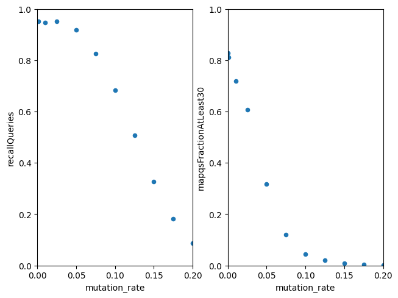
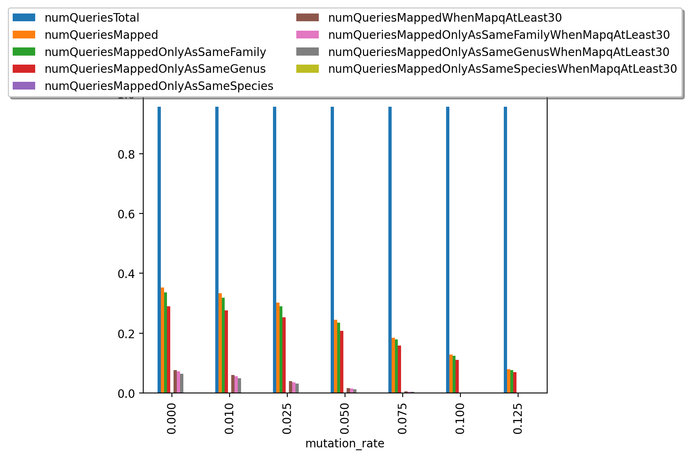

# Marker alignments paper
by Wojtek, Kathryn, Dan, possibly others

# Introduction

```
to do:
This claims that reference bias is a problem in read mapping, and particularly for eukaryotes

It's a working theory at best
add citations / context or get rid of it
```

Methods of quantifying taxa in metagenomic samples that based on read mapping suffer from reference bias. 


Mechanisms of variation are different between prokaryotes and eukaryotes. Bacteria lose whole genes and functions, but also gain them through recombination. Eukaryotic genes have introns, so the tweaking is more gradual, and small differences in sequence lead to very different phenotypes.

In eukaryotes, mapping reads for an organism that is only broadly characterized in the reference (a different strain or species) results in reference bias. The organism might be skipped, or reported as a mixture of a closely related species.

We show reference bias can be mitigated by incorporating secondary alignments as evidence against some taxa being present. We show this increases sensitivity when mapping to a EukDetect reference of BUSCOs and replacing the MAPQ filter. We also show we can identify off-target hits in the output of CCMetagen.


# Background
```
to do:
these are loose notes about things I've heard about

explain how our new thing is new in relation to those things
```

## Reference bias


## Quantifying Eukaryotes is hard


1. Euk genomes are widely contaminated [@lind2021accurate] so bacterial reads match to them spontaneously.

2. The level of noise is high enough that reads to e.g. fungal sequences completely fail.
[The use of taxon-specific reference databases compromises metagenomic classification](https://pubmed.ncbi.nlm.nih.gov/32106809/)

3. The Euk genomes are larger and differ from each other by less

4. The references are quite spotty: there's like a thousand assemblies, 148,000 described, 2-3 mln estimated https://en.wikipedia.org/wiki/Fungus.

5. Telling apart multiple species in the sample: an inexact match to a reference looks like a mixture of related species

## Current tools

Finding taxa in a metegenomic sample can be achieved by mapping reads to a reference database. K-mer methods (Kraken) and de novo assembly (anvio) are possible alternatives to read mapping.

Out of K-mer methods, CCMetagen[@marcelino2020ccmetagen] stands out as an alternative new tool developed for genomic epidemiology use. It is based on a specialised aligner KMA[@clausen2018rapid] that handles redundant databases, so it can use all possible genomes as its reference. Further it does reference-guided assembly on the reads, and assigns each sequence a separate match. Unfortunately it does not attempt to provide a list of species in the sample, but rather, a summary of naturally redundant KMA results into taxonomic units.

Metaphlan is the most established tool for running `bowtie2` on a reference of marker genes. Massive reference, [~1.1M unique clade-specific marker genes identified from ~100k reference genomes (~99,500 bacterial and archaeal and ~500 eukaryotic)](https://github.com/biobakery/biobakery/wiki/metaphlan3).

[Kaiju](https://kaiju.binf.ku.dk/) uses protein alignments, trying to get higher sensitivity.


EukDetect achieves sensistivity through aligning to a reference of Eukaryotic BUSCOs and heavy filtering. The possibly-ambiguous reads are assigned low MAPQ scores.


# Conclusion

```
to do:
this tries to explain why what I did is good and clever

use it to structure further work
```


Our contributions are:

- an explanation of how off-target hits happen, which helps authors of tools that interpret read mapping as counts of taxa
- software that runs and interprets alignments to EukDetect's reference database, and possibly to other reference databases, which helps people who have metagenomic data and need to analyse in taxa present
- the analysis of MicrobiomeDB data, which helps people who want to know what eukaryotes are present in human microbiomes


We've not yet contributed, but could contribute:

- a better way of integrating multiple results for a taxon
- software for building references that will work well with our method, which would help bioinformaticians in setting up analyses like ours
- a reference for traces of animal DNA, which would help people who study samples where they might be present
- an analysis of host blood meals of a mosquito dataset, which would help epidemiologists and people who want to know what different mosquitoes feed on


We've had ideas about:

- using this work to detect anti-microbial resistance genes (is there a universal database of known AMR variants of genes?) 


Our method is new because:

- nobody else interprets low MAPQ reads as a good alignment in the wrong place
- nobody else interprets secondary alignments as evidence against taxon being present
- nobody else uses network methods


Our method is good because:

- the method works at very low abundances, it's even better at it than EukDetect
- the method reports mixtures of related species more sensitively than EukDetect
- the method does not skip, or bias counts against, species that only approximately match the reference

Our method would be even better if:

- the method modelled the gap between reference and signal
  + reporting it could be interesting
  + one clear filter for taxa could be more accurate than a few sequential ones
  + an explanation how the gap between reference and signal looks in read mapping results when they're summarized by taxon

# Methodology and results


## EukDetect has a reference bias
```
to do:
This shows that EukDetect has a reference bias

It doesn't say why having reference bias is bad

Discuss the simulation results - what do I report to make it more convincing

Discuss the diagrams? I want to demonstrate low MAPQ and off-target hits

```

Methods of differentiating species through their sequences can be tested in silico through simulation [@hovhannisyan2020crossmapper]. We use `wgsim` [@li2011wgsim] to simulate reads from EukDetect's reference of BUSCOs, and use `bowtie2` [@langmead2012fast] to align them back to the reference.

In the SAM specification [http://samtools.github.io/hts-specs/SAMv1.pdf] the MAPQ field is defined as a measure of mapping quality - certainty of where the read should be positioned in the reference genome. EukDetect uses this field as a filter on evidence about presence of different species in a metagenomic sample.

We show that EukDetect's MAPQ >= 30 filter is unnecessarily restrictive towards novel strains, and precludes an otherwise feasible identification of a novel species to its genus.


\newpage


### Novel strains - MAPQ drops before recall drops
We sample reads from the reference running `wgsim` with mutation rate in a range of values between 0.0 and 0.2, base error rate set to zero, and other parameters default to investigate the effect of a sequenced species being of a different genotype / strain than the reference.

We see that the fraction of reads passing through EukDetect's MAPQ filter drops rapidly as mutation rate increases, while recall (a fraction of reads that map back to the BUSCO they were sampled from) is much more robust:




\newpage

Precision (a proportion of correctly mapping reads among the reads that map to any reference) stays between 95% and 96% throughout the range of values. This is concordant with `bowtie2` preserving precision over recall as seen in e.g. [@peng2015re].

We see that mutated reads, even as they get aligned less frequently, overwhelmingly map to a correct taxonomic unit, or at least the same genus or family.


We could, but didn't yet, replicate this conclusion for the range of read lengths, and also with the base error model instead of the mutation rate model.

All the data that was generated in the simulation is [in the supplement](supplement/wgsim.tsv).

\newpage

### Novel species - low MAPQ, recall

We investigate the effect of larger gaps in the reference by taking every tenth species out of EukDetect's reference, simulating reads, and aligning them against the rest of the species.


\newpage

The precision is still high:



All the data for "leave one out" with a few mutation rates added is [in the supplement](supplement/wgsimLeaveOneOut.tsv).

\newpage

### Errors favour closely related species

Most errors are near misses in the mutated reads example, and the "take one out" scheme still mostly works on the genus level. This is what we have to support the case that errors favour closely related species.

We also have a theoretical model presented by these two diagrams:


Diagram 1a. With X' and X'' differing from X only by aggregated single-nucleotide changes, reads preferentially map to the closer X'. MAPQ and percentage identity get lower, but the information in the reads is sufficient to report the nearest taxon.
```
  ___ X''   AACTAACAATATAA
 /
 \____ X'   AACAAACAAAAATA
  \____ X   AAAAAAAAAAAAAA
```

Diagram 1b. If X' misses some of the sequence, some reads map to X'' instead.
```
  ___ X''   AACTAACAATATAA
 /
 \____ X'   AACAA____AAATA
  \____ X   AAAAAAAAAAAAAA
```

\pagebreak


## Summary of our method
```
This is the method

It is unfortunately really ad-hoc, how do I make it less ad-hoc?

```

### `bowtie2`
We set `bowtie2` to report multiple alignments per query. This lets us add structure on the level of markers:
- count reads aligned multiply for each pair of markers as proxy for similarity
- use the MCL algorithm to produce clusters
- use average alignment identity as proxy of distance from "true" sequence
- use count of reads as evidence threshold
and similarly on the level of taxa.

This lets us set up a sequence of filters similar to EukDetect without relying on the MAPQ field.


*Filter 1. (Marker clusters)*

For each taxon, classify each marker as "at least average" or "below average" based on identity in its marker cluster. Reject taxa for which the majority of the markers are below average.

*Filter 2. (Unambiguous hits)*

Keep taxa which have at least two markers and four reads, and identity of at least 95%.

*Filter 3. (Strong ambiguous hits)*

In taxon clusters where no taxon has identity of at least 95%, keep taxa which have least four markers and eight reads. Report them together.

This provides us with a sensitive and appropriately accurate approach to reporting presence of Eukaryotes in a large number of samples.

### `KMA`
We set KMA to report all assembled fragments of reads for each template.

We process the fragment with an all-to-all nucleotide BLAST at 97% identity. For each pair of fragments that match, we compute their similarity as a fraction of query length to template length. Then we run MCL.

We have found KMA helpful in investigating samples that are dominated by a novel unknown taxon, similarly to the tool's intended use in genomic epidemiology. Its additional capabilities are of little use when detecting rare species - say a eukaryote that only contributes a small number of reads to the metagenomic sequence - and the resource costs are formidable, so we have not further investigated its use.

## Software implementation
```
to do:
This section is about the software
Figure out what should actually be here
```

We implement our way of interpreting results of alignments to markers as a Python package, `marker_alignments`. It uses a module `pysam` to read alignments into a following SQLite table:

| column | type | description |
| -- | -- | -- |
| query | text | read identifier |
| taxon | text | name of matched taxon |
| marker | text | name of matched taxon |
| coverage | number | fraction of marker covered by match  | 
| identity | number | fraction of bases agreeing between query and reference  | 

Counts of entries and the coverage field are used for quantification, and identity is mainly used for clustering and filtering.

Filtering and reporting is implemented with SQL queries and Python code. 

Clustering is based on a `markov_clustering` package, a Python implementation of the MCL algorithm.

In addition we also provide a Nextflow workflow, `marker-alignments-nextflow`. All our software is freely available on GitHub under an MIT license.


# Examples
```

```
## What would make a good example?

A good example would be specific to the improvement in the method: something about better specificity, or reporting variation in species beyond what SNPs can produce.

Maybe reporting those missing pieces of protein from diagram 2?

## Interesting cases I came along
### Example 1 - off-target hits in more than just a genus
SRR6262267 is a run from a sample dominated by *Trichosporon asahii* - according to SRA Traces, 23.68% of the reads in the sample can be attributed to this organism ([source](https://trace.ncbi.nlm.nih.gov/Traces/sra/?run=SRR6262267)).

```
TODO an example - perhaps a heatmap of counts for BUSCOs in each Trichosporon?
Actually, EukDetect reports only T. asahii, because the other off-target hits are for the same genus - find something :).
TODO this will require some visualisation tools.
```

### Example 2 - sticking to the reference too closely brings up nothing
Mucor example, demonstrate EukDetect returns nothing which it really should.

### Example 3 - BUSCOs vs clusters
Maybe a drawing or a visualisation: a graph with BUSCOs corresponding to a shading of each node, added edges, and a shading or a line around clusters that end up together?

## Potential application 1 - host blood meal
Identify host blood meal in metagenomic studies of mosquitos.


## Potential application 2 - AMR
Detection/quantification of antimicrobial resistance (AMR) genes in metagenomic samples

## MicrobiomeDB studies
```
to do:
This is about MicrobiomeDB results.

Decide if they should be a part of the paper and how.
```

We analyzed all data on MicrobiomeDB.

| study | num samples | num samples with reported taxa | num reported taxa |
| -- | -- |-- | -- |
| HMP | xxx | yyy | zzz |


## DIABIMMUNE
```
to do:
This is an expanded part of the above that does a comparison for DIABIMMUNE.
Write a program to report the numbers, for transparency and because you will need to redo it.

Make a point that our method improves sensitivity, and to have a comparison, maybe independently align to whole cDNA of S. cerevisiae?

```

Here's a not yet formal comparison to DIABIMMUNE.
DIABIMMUNE reports 

Just the paper DIABIMMUNE reported 8 samples. I think it's mostly the difference between references - new one has a bit more.
We're more courageous in reporting species, and report 119 extra results. It shows up for the most common S. cerevisiae - we call it 42 more times - and M. restricta - 9 more times.

### 3100266
Here's a case where we do something weird. EukDetect reports P. nordicum, but we realise it's a cluster:
```
id      taxon   num_markers     num_reads       avg_identity
1       1429867|Penicillium_camemberti_FM_013   34      73      0.960183806201549
1       1439350|Penicillium_fuscoglaucum_FM041  33      74      0.962397902985074
1       1931374|Penicillium_sp_BW_MB    101     243     0.958158950450451
1       1931375|Penicillium_sp_BW_12    10      31      0.959146928571428
1       229535|Penicillium_nordicum     45      102     0.954239219101123
1       2488753|Penicillium_sp_SPG-F1   10      29      0.964647588235294
1       2593313|Penicillium     124     313     0.967739331578951
1       48697|Penicillium_freii 117     288     0.959325344168261
1       5073|Penicillium        306     359     0.962057904903424
1       60169|Penicillium_polonicum     41      78      0.959593049295774
1       60171|Penicillium_verrucosum    40      70      0.955100714285714
1       60172|Penicillium_solitum       39      81      0.959004702702702
2       5480|Candida_parapsilosis       8       10      0.996333894736842
```
and because they're all above 95%, we return them all. What I would prefer is to return the whole cluster, but how should I know?

### 3104340
Here's a case where we do something good.
```
G80329
diabimmune-paper.tsv.csv:G80329,Candida parapsilosis,5480,27,78,15.70%,8.04%,99.64%
diabimmune-paper.tsv.csv:G80329,Rhodotorula,5533,3,5,3.53%,3.76%,100.00%
diabimmune-paper.tsv.csv:G80329,Chaetomium globosum CBS 148.51,306901,3,5,1.69%,4.14%,99.79%
diabimmune.tsv:3104340  G80329  237561  Candida_albicans_SC5314 8
diabimmune.tsv:3104340  G80329  306901  Chaetomium_globosum_CBS_14851   3
diabimmune.tsv:3104340  G80329  5480    Candida_parapsilosis    19
diabimmune.tsv:3104340  G80329  5533    Rhodotorula     3
```
The above does not show that, but we are able to show that the presence of additional C. albicans is very convincing - the hits are in entirely different marker clusters.


\newpage
# Not in the paper
I've written these sections but they're not really useful. They might be good for talking about the stuff internally.

\newpage

## Definitions

**taxon** - an organism, in this context an organism that had its genome sequenced, appears in the reference database, and may or may not be present in the sequenced sample

**BUSCO** - a family of genes that are mostly present in each taxon and mostly single-copy

**marker** - a DNA sequence of a gene in a taxon that is assumed to be unique to the taxon. Markers in related taxa can be similar, for example if they belong to the same BUSCO

**reference database** - one of the inputs for an aligner, in this context it's a reference of markers that can be matched to

**alignment / hit** - a read in the sequenced sample that was found by an aligner to match a marker in the reference

Aligners like `bowtie2` can report multiple alignments per read. In that case, we can distinguish:

**primary alignment** - the best match for the read (based on alignment score, sequence identity, or other metric)

**secondary alignments** - alignments corresponding to matches for a read that are not the best one


We would also like to differentiate bewteen:

**target hit** - a read that comes from an organism $A$, and matches a marker $M'$ for a taxon $A'$, such that $A'$ is the closest taxon to $A$

**off-target hit** - a read that comes from an organism $A$, but matches a marker $M'$ for a taxon $A''$, and there is at least one taxon $A'$ closer to $A$ than $A''$ is

## Sources of off-target hits
```
to do:
this part is all anegdotal
it's about hits I saw in the data that I think are off-target and that I think I understand

add evidence to it or get rid of it
```

Even if the reference contains all taxa that might be in the sample, there are still some possible sources of off-target hits, like:

1. random bias: the sequencing process introduces errors and short sequences can coincide by chance

2. ubiquitous subsequences: in end-to-end alignments, these look like clipped alignments to where a reference finishes with a sequence corresponding to e.g. a binding site common in proteins

3. missing markers: reads for a marker that is missing in the reference instead align to similar markers

Our method addresses these kinds of off-target hits through a combination of filters or thresholds on read quality and length, alignment length, and numbers of markers required to detect a taxon.

An entirely different kind of off-target hits is due to a sequenced organism having no exact match in the reference. We will describe how this happens, and how it can be addressed by making use of secondary alignments.

### A model for off-target hits due to inexact matches
```

to do:
this is my conjecture for how off-target hits can contain signal:
- an inexact match looks in alignments as a mix of related matches
- asking for best alignment sets up competitive mapping and that's not good
- secondary alignments are good for the next part


make it a cartoon or less long
merge with the next part (marker clusters)
show evidence that it happens, and that it happens in the way described
```

Suppose an organism $A$ has a version $b_A$ of a BUSCO $b$, and the reference contains markers $b_{A_1},  \dots  b_{A_n}$ for taxa $A_1,  \dots  A_n$. Let us say $A$ is most similar to $A1$ - perhaps it's another strain of the same species. Assume also a least common ancestor $A_0$ of $A$ and $A_1$, and $A_{00}$ of $A_0, A_2, \dots A_n$.
As mutations accumulate over time, we can predict $b_A$ will be most similar to $b_{A_1}$, but - in places where $A_1$ has diverged from $A_0$ - some segments of $b_A$ are most similar to other $b_{A_i}$. Some segments of $b_A$ could also be equally similar in all $b_{A_i}$, if there has been reason for that sequence not to change since the joint common ancestor $A_{00}$.

When reads from $b_A$ are aligned to each of the $b_{A_i}$, we expect match identity to form a distribution. The $A_i$ which differ more from $A$ should have to lower average match identity and fewer matches, but might still attract high identity matches.


So, competitive alignment of reads from $b_A$ between $b_{A_1} \dots b_{A_n}$ will not entirely favour the closest $A_1$.

If we ask an aligner to report a single best alignment for each read, we expect to see $h_1$ hits to $b_{A_1}$, and smaller amounts $h_i$ of hits for other $b_{A_i}$, such that $H = \sum_{i=1}^{n}h_i$ is proportional to the count of reads coming from sequencing b(A). We also expect ratios of $H$ to $h_i$ to be related to sequence similarity between $b_A$ and $b_{A_i}$ - the further $A$ is from $A_1$, the larger the number of off-target hits $H - h_1$.

The effect of $b_{A_1} \dots b_{A_n}$ 'competing' for the best alignment of each read is illuminated when an aligner is asked to report all reads. Some of $h_2  \dots  h_n$ are then accompanied by secondary alignments to $b_{A_1}$ - call them $s_1$, and some of $h_1$ will be accompanied by secondary alignments to $b_{A_2}  \dots  b_{A_n}$, $s_2 \dots s_n$. If $h_1$ is much larger than $h_i$, $s_1$ should be much smaller than $s_i$ and thus $\frac{h_1}{s_1}$ should be larger than $\frac{h_i}{s_i}$ and independent of $H$.

Thus secondary alignments help us differentiate the presence of an organism $A$ reported as many hits to $A_1$ and fewer hits to A2 from the presence of two unrelated organisms X and Y. For example, we can report a ratio of primary to secondary alignments for each taxon.

It is possible for $b_{A_1}$ to be very different from $b_A$, or missing from the reference entirely. Perhaps the genome of $A_1$ is incorrectly annotated, or $A_1$ has lost b when adapting to its niche.

## Building marker clusters
```
to do:
this introduces marker clusters

it tries to theorise what kinds of clusterings there can be
EukDetect uses a taxonomic clustering but we do an empirical one

remove most of it, it's incredibly wordy
add a visualisation of marker clusters in examples
```

The effect of including secondary alignments is to only add hits to sequences similar to ones already present - after all, they both match on a read. Because identifying off-target hits requires grouping similar markers, secondary alignments provide valuable context for what markers are generally similar to what is present in the sample.

In our method, we run an aligner with as many secondary alignments as we can computationally afford, and then build a similarity graph where all matched markers are nodes and counts of reads that align to both markers are weighted edges. We then pass the triples (marker1, marker2, weight) to a clustering program, MCL.

Using a machine learning program like MCL relieves us from more precise modelling of what it means for two markers to be similar, or relying on prior information on what should be matched together.

MCL produces clusters with several valuable properties:

- markers in a cluster generally come from a single BUSCO and closely related taxa, but not always 
- broadly similar markers are grouped in larger clusters
- unique hits correspond to clusters with single markers
- a marker sharing reads with multiple putative clusters either gets assigned to one of them, or results in two clusters being merged


## Reporting taxa
```
to do:
this is about how the software makes calls on the taxon level
currently we sequentially apply a few filters and transforms
(this doesn't even describe them all)
the unknown taxon transform doesn't work as well as it should yet

get some clarity on the method and try to improve it?
```

### Filter built from marker clusters
Clusterings of markers which attract similar matches allows for classifying taxa by having each marker cluster "vote" for its taxon, based on how that taxon's markers do in that cluster. This can be done in a number of ways as long as the marker clusters are required to only be approximately correct.

We choose to measure how good an alignment is through match identity - a number of bases that agree between query and reference divided by the alignment length. Then for each marker cluster, we compute an average for all matches in the cluster, as well as an average for matches in each marker. Then we discard taxa where less than half of each taxon's markers that are at least average in their cluster.

We can expect that this filter will work well enough to discard the additional taxa introduced to the result when setting the aligner to report secondary alignments, since they are on average inferior. Similarly, a version of a BUSCO that is overall inferior but has a locally better subsequence can be expected to accrue bad matches, get paired up with overall better versions of the BUSCO in the marker clustering process, and then help get its taxon rejected.

The filter based on marker clusters leaves us with taxa whose markers are not mostly off-targets of other markers in the reference. There can still be a gap between reference and signal we might get a mixture of matches at a marker level.

### Taxon transform + identity filter
We build another graph where taxa are nodes and (directed) edges is a fraction of shared reads. Then we run MCL again to get taxon clusters.

This groups taxa which are similar and, hopefully, each corresponds to at most one taxon. 

### Minimal evidence filter

After that there's still a need for general filtering like EukDetect and Metaphlan do.

We do it at the end and have separate thresholds for called taxa and vaguely identified blobs, as the burden of evidence is higher for taxa with lower identity.

This part is a combination of read counts, marker counts.

\newpage
#Bibliography
